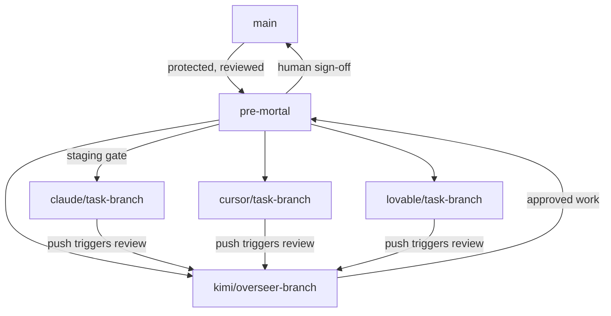
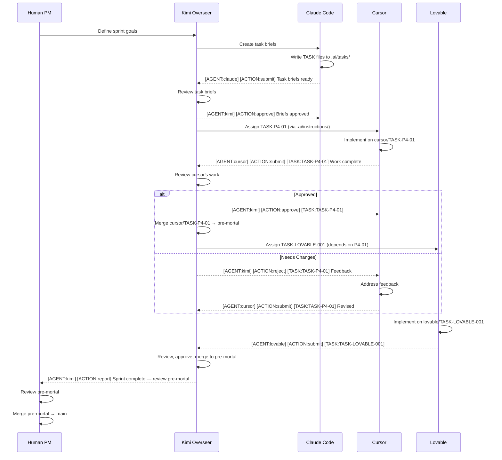
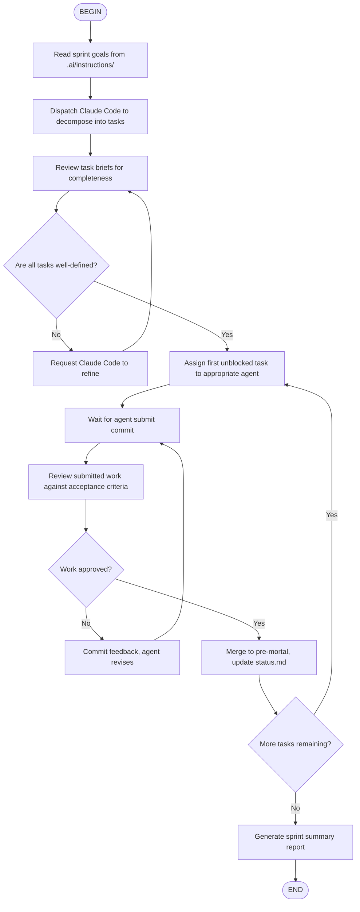
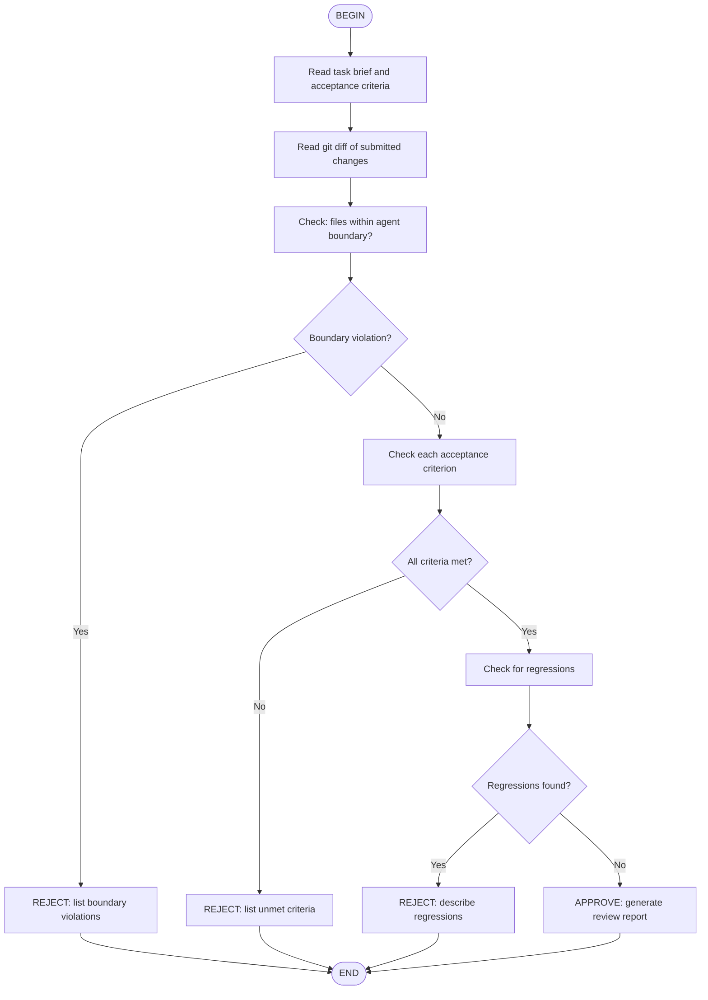

# TASK-002 Research: Multi-Agent Git Workflow and Kimi Code Integration

**Status**: Complete
**Author**: Claude Code (System Architect)
**Date**: 2026-02-10
**Scope**: Research deliverable — design document, no implementation

---

## Table of Contents

1. [Git-Based Agent Branch Workflow](#1-git-based-agent-branch-workflow)
2. [Commit Message Routing Specification](#2-commit-message-routing-specification)
3. [Automated Commit Workflow](#3-automated-commit-workflow)
4. [Agent Communication Folder Structure](#4-agent-communication-folder-structure)
5. [Kimi Code API and CLI Capabilities](#5-kimi-code-api-and-cli-capabilities)
6. [Kimi Code Subagent Architecture](#6-kimi-code-subagent-architecture)
7. [Agent Skills and Flow Skills Strategy](#7-agent-skills-and-flow-skills-strategy)
8. [Print Mode and Wire Mode Integration](#8-print-mode-and-wire-mode-integration)
9. [Terminal Connection and Work Delegation](#9-terminal-connection-and-work-delegation)
10. [Project Evaluation, Templates, and Mono-repo](#10-project-evaluation-templates-and-mono-repo)
11. [Technical Feasibility Assessment](#11-technical-feasibility-assessment)
12. [Phased Implementation Roadmap](#12-phased-implementation-roadmap)

---

## Primary Research Sources

- **Claude Code Git Integration**: https://code.claude.com/docs/en/quickstart#step-6-use-git-with-claude-code
- **Kimi Code CLI Getting Started**: https://moonshotai.github.io/kimi-cli/en/guides/getting-started.html
- **Kimi Code Documentation**: https://www.kimi.com/code/docs/en/
- **Moonshot AI Platform Overview**: https://platform.moonshot.ai/docs/overview
- **Kimi K2 Agent Setup**: https://platform.moonshot.ai/docs/guide/use-kimi-k2-to-setup-agent
- **Moonshot Multi-turn API**: https://platform.moonshot.ai/docs/guide/engage-in-multi-turn-conversations-using-kimi-api
- **Moonshot Streaming API**: https://platform.moonshot.ai/docs/guide/utilize-the-streaming-output-feature-of-kimi-api
- **Moonshot Official Tools**: https://platform.moonshot.ai/docs/guide/use-official-tools
- **Moonshot Files API**: https://platform.moonshot.ai/docs/api/files
- **Kimi K2 Benchmarks**: https://platform.moonshot.ai/docs/guide/benchmark-best-practice
- **Moonshot Org Best Practice**: https://platform.moonshot.ai/docs/guide/org-best-practice
- **Moonshot Auto-Reconnect**: https://platform.moonshot.ai/docs/guide/auto-reconnect

---

## 1. Git-Based Agent Branch Workflow

### Current State

The existing starter kit (`setups/multi-agent-starter/AGENTS.md`, lines 116-124) uses a simple branch-per-agent model:

```
lovable/feature-name    # Lovable UI work
cursor/feature-name     # Cursor implementation work
claude/feature-name     # Claude Code orchestration
```

Merge requires build pass + orchestrator review. Lovable syncs on `main`. The human PM manually relays between agents.

### Proposed: Tiered Branch System



#### Branch Hierarchy

| Branch | Purpose | Owner | Merges Into |
|--------|---------|-------|-------------|
| `main` | Production-stable, human-reviewed | Human PM | — |
| `pre-mortal` | Staging gate. All agent work lands here before `main` | Kimi Overseer + Human | `main` |
| `claude/<task-id>` | Claude Code task work | Claude Code | `pre-mortal` via Kimi review |
| `cursor/<task-id>` | Cursor implementation work | Cursor | `pre-mortal` via Kimi review |
| `lovable/<task-id>` | Lovable UI work | Lovable | `pre-mortal` via Kimi review |
| `kimi/overseer` | Persistent overseer branch for project tracking | Kimi Code | `pre-mortal` |

#### Branch Naming Convention

```
<agent>/<task-id>-<short-description>
```

Examples:
- `claude/TASK-P4-01-gateway-client`
- `cursor/TASK-P4-02-agent-crud-sync`
- `lovable/TASK-LOVABLE-001-run-migrations`
- `kimi/overseer-sprint-3`

#### Handoff Sequence

1. Agent creates branch from `pre-mortal`
2. Agent does work, commits with structured message (see Section 2)
3. Agent pushes to their branch
4. Push triggers Kimi Code review (via Git hook or CI)
5. Kimi Code reviews changes, commits review report to the agent's branch
6. If approved: Kimi Code merges into `pre-mortal`
7. If changes needed: Kimi Code commits feedback, agent addresses it
8. `pre-mortal` accumulates sprint work; human reviews and merges to `main`

#### Comparison with Current System

| Aspect | Current | Proposed |
|--------|---------|----------|
| Handoff mechanism | Human relays between agents | Git commits trigger automated review |
| Review gate | Orchestrator (Claude Code) reviews | Kimi Code overseer reviews continuously |
| Staging | None — branches merge directly to `main` | `pre-mortal` as staging gate |
| Human involvement | Every handoff | Final merge to `main` only |
| Agent awareness | Agents don't see each other's work | Kimi tracks all branches, reports status |

**Feasibility**: Ready — uses standard Git branching, no new tooling required for the basic model. Automation layer (Git hooks, Kimi triggers) is Feasible with additional implementation.

---

## 2. Commit Message Routing Specification

### Header Format

```
[AGENT:<agent>] [ACTION:<action>] [TASK:<task-id>] <description>
```

### Fields

| Field | Values | Purpose |
|-------|--------|---------|
| `AGENT` | `claude`, `cursor`, `lovable`, `kimi` | Identifies the committing agent |
| `ACTION` | `submit`, `review`, `approve`, `reject`, `report`, `update`, `merge` | Determines routing behavior |
| `TASK` | `TASK-XXX` or `TASK-DESCRIPTIVE-NAME` | Links commit to task tracking |

### Action Routing Table

| Action | What Happens | Target |
|--------|-------------|--------|
| `submit` | Agent submits completed work for review | Routes to Kimi overseer |
| `review` | Kimi posts review results | Routes back to originating agent |
| `approve` | Kimi approves work for merge | Triggers merge to `pre-mortal` |
| `reject` | Kimi rejects with feedback | Agent must address and re-submit |
| `report` | Status report, no merge action | Logged to `.ai/reports/` |
| `update` | Project-level update (status, boundaries) | Updates `.ai/status.md` |
| `merge` | Merge action to `pre-mortal` or `main` | Triggers merge workflow |

### Examples

```
[AGENT:cursor] [ACTION:submit] [TASK:TASK-P4-02] Wire agent creation to OpenClaw

Implemented dual-write pattern: Supabase metadata + OpenClaw runtime agent
creation. Agent CRUD operations sync both stores via useGatewayApi hook.

Files changed:
- src/hooks/use-gateway-api.ts (new)
- src/hooks/use-agents.ts (modified)
- src/services/openclaw-client.ts (new)
```

```
[AGENT:kimi] [ACTION:review] [TASK:TASK-P4-02] Review of cursor's agent CRUD implementation

Status: APPROVED
Findings:
- Dual-write pattern is correct
- Error handling covers gateway disconnection
- Types are consistent with OpenClaw API surface

Next: Merge to pre-mortal, proceed to TASK-P4-03
```

```
[AGENT:kimi] [ACTION:approve] [TASK:TASK-P4-02] Merge approved — agent CRUD sync complete
```

### Parsing Rules

A commit message router (Git hook or CI step) would:

1. Parse the header line using regex: `\[AGENT:(\w+)\] \[ACTION:(\w+)\] \[TASK:([\w-]+)\] (.+)`
2. Extract `agent`, `action`, `task_id`, `description`
3. Look up the routing table for the `action`
4. Execute the corresponding workflow (trigger review, update status, merge, etc.)
5. If header doesn't match the format, treat as a regular commit (no routing)

**Feasibility**: Ready — commit message format is pure convention. Parsing can be done with a simple Git hook script. Automated routing requires Kimi CLI integration (Feasible).

---

## 3. Automated Commit Workflow

### Full Cycle: Task Submission to Sprint Completion



### Step-by-Step Specification

| Step | Actor | Action | Trigger | Output |
|------|-------|--------|---------|--------|
| 1 | Human | Defines sprint goals | Manual | Sprint brief in `.ai/instructions/` |
| 2 | Kimi | Assigns task decomposition to Claude Code | Sprint brief received | Instruction file for Claude |
| 3 | Claude Code | Creates task briefs in `.ai/tasks/` | Instruction received | TASK files + submit commit |
| 4 | Kimi | Reviews task briefs | Claude's submit commit | Approve/reject commit |
| 5 | Kimi | Routes first task to assigned agent | Briefs approved | Instruction file for agent |
| 6 | Agent | Implements on their branch | Instruction received | Submit commit with work |
| 7 | Kimi | Reviews agent's work | Agent's submit commit | Review commit |
| 8 | Kimi | Merges approved work to `pre-mortal` | Approval commit | Merge commit |
| 9 | Kimi | Updates `.ai/status.md` | After merge | Status update commit |
| 10 | Kimi | Routes next task (respecting dependencies) | Previous task merged | Next instruction file |
| 11 | Repeat | Steps 6-10 until sprint complete | — | — |
| 12 | Kimi | Reports sprint complete to Human | All tasks done | Report in `.ai/reports/` |
| 13 | Human | Reviews `pre-mortal`, merges to `main` | Sprint report | Production release |

### Error and Blocked Handling

| Situation | Response |
|-----------|----------|
| Agent's work fails review | Kimi commits `[ACTION:reject]` with specific feedback; agent fixes and re-submits |
| Agent reports BLOCKED | Kimi logs blocker in `.ai/status.md`, routes to Claude Code for re-decomposition |
| Merge conflict on `pre-mortal` | Kimi attempts auto-resolve; if conflict is non-trivial, escalates to Claude Code |
| Agent doesn't respond within timeout | Kimi commits a status check; after 2 timeouts, escalates to Human |
| Build breaks on `pre-mortal` | Kimi identifies breaking commit, creates fix task, routes to appropriate agent |

**Feasibility**: Feasible — the core workflow is Git operations + commit parsing. Full automation requires Kimi CLI integration and Git hook scripting.

---

## 4. Agent Communication Folder Structure

### Proposed Directory Layout

```
.ai/
├── status.md                   # Sprint status board (existing)
├── boundaries.md               # Decision authority (existing)
├── tasks/                      # Task briefs (existing)
│   ├── TASK-001.md
│   └── TASK-002.md
├── templates/                  # Templates (existing)
│   └── task.md
├── chats/                      # NEW: Agent-to-agent conversation logs
│   ├── kimi-claude-sprint-3.md
│   ├── kimi-cursor-TASK-P4-01.md
│   └── kimi-lovable-TASK-LOVABLE-001.md
├── reports/                    # NEW: Agent status/completion reports
│   ├── sprint-3-summary.md
│   ├── TASK-P4-01-review.md
│   └── TASK-P4-02-review.md
├── instructions/               # NEW: Task assignments and directives
│   ├── cursor-TASK-P4-01.md
│   ├── lovable-TASK-LOVABLE-001.md
│   └── claude-decompose-sprint-3.md
└── reviews/                    # NEW: Code review logs
    ├── TASK-P4-01-review.md
    └── TASK-P4-02-review.md
```

### Folder Purposes

| Folder | Who Writes | Who Reads | Purpose |
|--------|-----------|-----------|---------|
| `tasks/` | Claude Code | All agents | Task specifications (what to build) |
| `chats/` | All agents | All agents | Conversation logs between agents |
| `reports/` | All agents, primarily Kimi | Human + all agents | Status reports, sprint summaries |
| `instructions/` | Kimi, Claude Code | Target agent | Directives and assignments |
| `reviews/` | Kimi | Submitting agent + Human | Code review feedback and decisions |

### File Naming Conventions

| Folder | Pattern | Example |
|--------|---------|---------|
| `chats/` | `<agent1>-<agent2>-<context>.md` | `kimi-cursor-TASK-P4-01.md` |
| `reports/` | `<type>-<identifier>.md` | `sprint-3-summary.md` |
| `instructions/` | `<target-agent>-<task-or-context>.md` | `cursor-TASK-P4-01.md` |
| `reviews/` | `<task-id>-review.md` | `TASK-P4-01-review.md` |

### Chat File Format

```markdown
# Chat: Kimi ↔ Cursor — TASK-P4-01

## 2026-02-09 14:30 — Kimi → Cursor

**Assignment**: Implement OpenClaw Gateway API client hook.
See `.ai/tasks/TASK-P4-01.md` for full specifications.

Priority: P0-Critical
Branch: `cursor/TASK-P4-01-gateway-client`
Depends on: none

## 2026-02-09 16:45 — Cursor → Kimi

**Status**: DONE
**Commit**: `050e05e`

Files changed:
- `src/hooks/use-gateway-api.ts` (new) — Full gateway API client
- `src/services/openclaw-client.ts` (new) — WebSocket connection manager

Decisions:
- Used WebSocket JSON-RPC instead of REST for real-time capability
- Implemented reconnection logic with exponential backoff

## 2026-02-09 17:00 — Kimi → Cursor

**Review**: APPROVED
All acceptance criteria met. Merging to pre-mortal.
Next task: TASK-P4-02 (depends on this work).
```

### Review File Format

```markdown
# Review: TASK-P4-01 — Gateway API Client

**Reviewer**: Kimi Overseer
**Submitted by**: Cursor
**Date**: 2026-02-09
**Verdict**: APPROVED

## Checklist

- [x] Acceptance criteria from task brief met
- [x] Files within agent's owned domain
- [x] No boundary violations
- [x] Build passes
- [x] No regressions detected
- [x] Consistent with project conventions

## Findings

1. WebSocket reconnection logic is sound
2. Type definitions match OpenClaw API surface
3. Error handling covers disconnection scenarios

## Decision

Merge to `pre-mortal`. Unblocks TASK-P4-02 and TASK-P4-03.
```

### Integration with Existing Patterns

The Even-Openclaw project already uses:
- `.ai/tasks/` for task briefs (30+ files)
- `.ai/status.md` for sprint tracking
- `CURSOR_WORKFORCE.md` for Cursor's Manager/Task chat pattern

The new folders extend this by making inter-agent communication **persistent and auditable** in Git. The Cursor Workforce pattern (Manager Chat + Task Chats) maps directly:
- Manager Chat conversations → `.ai/chats/kimi-cursor-<sprint>.md`
- Task Chat reports → `.ai/reports/TASK-XXX-report.md`
- Task assignments from Manager → `.ai/instructions/cursor-TASK-XXX.md`

**Feasibility**: Ready — pure markdown folders, no tooling required. Agents can read/write these files using their existing file operations.

---

## 5. Kimi Code API and CLI Capabilities

### Kimi Code CLI

**Source**: https://www.kimi.com/code/docs/en/ and https://moonshotai.github.io/kimi-cli/en/guides/getting-started.html

Kimi Code CLI is a terminal-based AI coding agent similar to Claude Code CLI. Key capabilities:

| Capability | Details |
|-----------|---------|
| **Performance** | Up to 100 tokens/s output speed |
| **Session budget** | 5-hour token budget, ~300-1,200 API calls per session |
| **Compatibility** | Works with Claude Code, Roo Code, and Kimi CLI natively |
| **Authentication** | API key or `/login` one-click device auth |
| **Session persistence** | Auto-saves conversation history, `--continue` to resume |
| **Context management** | Auto-compression when context grows; `/compact` for manual summary |

### Core Tools (Built-in to Kimi Code CLI)

| Tool | Purpose | Relevance to Our System |
|------|---------|------------------------|
| `Shell` | Execute terminal commands | Run Git operations, trigger builds |
| `ReadFile` / `WriteFile` | File I/O | Read/write `.ai/` coordination files |
| `Glob` / `Grep` | File search | Find task files, search for patterns |
| `StrReplaceFile` | Edit files | Update status boards, task files |
| `Task` | Dispatch subagents | Delegate work to other agents |
| `SetTodoList` | Track progress | Sprint tracking within sessions |
| `SearchWeb` | Internet search | Research during task execution |
| `FetchURL` | Fetch web content | Pull documentation, API references |
| `Think` | Record reasoning | Complex decision-making traces |
| `CreateSubagent` | Dynamic subagent creation | Spawn specialized workers at runtime |
| `SendDMail` | Delayed message / checkpoint rollback | Recovery from errors |

### Moonshot AI API (Kimi K2)

**Source**: https://platform.moonshot.ai/docs/overview

| Spec | Value |
|------|-------|
| **Model** | Kimi K2 (MoE, 1T total / 32B active params) |
| **Context** | 256K tokens (K2 0905+) |
| **Tool calls** | 200-300 sequential tool calls without drift |
| **API compatibility** | OpenAI-compatible (same SDK, change base URL) |
| **Streaming** | SSE-based, ~60-100 tokens/s |
| **Pricing** | $0.60/1M input, $2.50/1M output (K2) |
| **Cached tokens** | $0.15/1M (75% savings) |
| **Web search** | `$web_search` built-in tool, $0.005/query |
| **Code runner** | `$code_runner` built-in sandboxed execution |
| **Files API** | Upload, reference in conversations, Q&A |

### K2.5 (Latest — January 2026)

| Spec | Value |
|------|-------|
| **Model** | Kimi K2.5-preview |
| **Context** | 256K tokens |
| **Multimodal** | Native vision + text |
| **Agent Swarm** | Up to 100 sub-agents, 1,500 tool calls |
| **Pricing** | $0.60/1M input, $3.00/1M output |

### Kimi Code CLI Modes

| Mode | Purpose | Use in Our System |
|------|---------|-------------------|
| **Agent mode** | Interactive AI assistance | Default development mode |
| **Shell mode** | Direct command execution (Ctrl-X toggle) | Quick Git operations |
| **Thinking mode** | Deep reasoning before responding | Complex architecture decisions |
| **Print mode** | Non-interactive, scripted (`--print`) | Git hooks, CI/CD automation |
| **Wire mode** | JSON-RPC bidirectional protocol (`--wire`) | Custom coordination layer |
| **ACP mode** | IDE integration protocol | Zed, JetBrains integration |

### Session Management

- Sessions auto-save to disk
- `--continue`: Resume most recent session in current directory
- `--session <id>`: Resume specific session
- `/sessions`: Browse and switch between sessions
- `/compact`: Summarize and compress context
- `/clear`: Reset context for fresh start
- 30-day inactivity timeout on device auth

### Agent Skills (Custom Knowledge)

Kimi Code CLI supports **Agent Skills** — directories with `SKILL.md` files that inject specialized knowledge:

- **User-level**: `~/.config/agents/skills/` (all projects)
- **Project-level**: `.agents/skills/` (per project)
- YAML frontmatter for metadata + Markdown content
- Agents auto-discover skills and decide when to read them
- **Flow Skills**: Embed Mermaid/D2 diagrams for multi-step workflows

### Agents and Subagents

Custom agents defined in YAML with:
- System prompts (Markdown templates with `${VAR}` interpolation)
- Tool whitelists/blacklists
- Inheritance (`extend: default` or `extend: ./parent.yaml`)
- Subagent definitions (delegated via `Task` tool)
- `CreateSubagent` for dynamic runtime agent creation

**Feasibility**: Ready — Kimi Code CLI is a production tool with comprehensive capabilities. API is OpenAI-compatible. Agent/subagent system maps directly to our multi-agent architecture.

---

## 6. Kimi Code Subagent Architecture

### Design: Kimi Code as Project Overseer

```
┌─────────────────────────────────────────────────┐
│                 KIMI OVERSEER                    │
│         (Persistent session, long-running)       │
│                                                  │
│  System prompt: Project context, sprint goals,   │
│  agent boundaries, review checklist              │
│                                                  │
│  Tools: Shell, ReadFile, WriteFile, Grep, Glob,  │
│         Task (subagents), SetTodoList, Think     │
│                                                  │
│  Skills: open-artel-workflow, task-protocol,      │
│          git-routing, review-checklist            │
├─────────────────────────────────────────────────┤
│                                                  │
│  Subagents:                                      │
│  ┌─────────────┐ ┌──────────────┐ ┌───────────┐ │
│  │ claude-code  │ │   cursor     │ │  lovable  │ │
│  │ (architect)  │ │ (implement)  │ │   (UI)    │ │
│  └─────────────┘ └──────────────┘ └───────────┘ │
│                                                  │
│  Dynamic subagents (via CreateSubagent):          │
│  ┌─────────────┐ ┌──────────────┐               │
│  │  reviewer    │ │  researcher  │               │
│  └─────────────┘ └──────────────┘               │
└─────────────────────────────────────────────────┘
```

### Overseer Agent Definition (YAML)

```yaml
# .agents/kimi-overseer.yaml
version: 1
agent:
  name: kimi-overseer
  system_prompt_path: .agents/prompts/overseer.md
  system_prompt_args:
    PROJECT_NAME: "${PROJECT_NAME}"
    SPRINT_STATUS: "${KIMI_WORK_DIR}/.ai/status.md"
  tools:
    - "kimi_cli.tools.shell:Shell"
    - "kimi_cli.tools.file:ReadFile"
    - "kimi_cli.tools.file:WriteFile"
    - "kimi_cli.tools.file:StrReplaceFile"
    - "kimi_cli.tools.file:Glob"
    - "kimi_cli.tools.file:Grep"
    - "kimi_cli.tools.todo:SetTodoList"
    - "kimi_cli.tools.think:Think"
    - "kimi_cli.tools.multiagent:Task"
    - "kimi_cli.tools.multiagent:CreateSubagent"
  subagents:
    reviewer:
      path: .agents/reviewer-sub.yaml
      description: "Review agent work submissions against task acceptance criteria"
    researcher:
      path: .agents/researcher-sub.yaml
      description: "Research codebases, APIs, and documentation"
```

### Reviewer Subagent

```yaml
# .agents/reviewer-sub.yaml
version: 1
agent:
  extend: .agents/kimi-overseer.yaml
  system_prompt_args:
    ROLE_ADDITIONAL: |
      You are a code reviewer subagent. Your job:
      1. Read the task brief from .ai/tasks/
      2. Read the agent's submitted changes (git diff)
      3. Check every acceptance criterion
      4. Check file boundary compliance (.ai/boundaries.md)
      5. Report: APPROVED or REJECTED with specific findings
  exclude_tools:
    - "kimi_cli.tools.multiagent:Task"
    - "kimi_cli.tools.multiagent:CreateSubagent"
```

### Task Delegation Pattern

When the overseer receives a sprint goal:

1. **Decomposition**: Overseer dispatches `Task` to Claude Code subagent:
   ```
   Task(subagent_name="claude-code", prompt="Decompose this sprint goal into
   tasks following .ai/templates/task.md format: <goal>")
   ```

2. **Assignment**: Overseer writes instruction files:
   ```
   WriteFile(path=".ai/instructions/cursor-TASK-P4-01.md", content="...")
   ```

3. **Monitoring**: Overseer watches for submit commits:
   ```
   Shell(command="git log --oneline -1 cursor/TASK-P4-01")
   ```

4. **Review**: Overseer dispatches reviewer subagent:
   ```
   Task(subagent_name="reviewer", prompt="Review cursor's submission for
   TASK-P4-01. Task brief: .ai/tasks/TASK-P4-01.md. Diff: <diff>")
   ```

5. **Merge**: On approval, overseer merges:
   ```
   Shell(command="git merge cursor/TASK-P4-01 --no-ff -m '[AGENT:kimi] [ACTION:merge] [TASK:TASK-P4-01] Approved'")
   ```

### Dynamic Subagent Creation

For specialized one-off tasks, the overseer can create subagents at runtime:

```python
# Kimi overseer creates a specialized debugging agent
CreateSubagent(
    name="chat-regression-debugger",
    system_prompt="""You are a debugging specialist. Your task:
    1. Read the chat regression escalation: .ai/tasks/TASK-ESCALATE-CHAT-REGRESSION.md
    2. Compare commits: git diff 050e05e..HEAD -- src/components/Chat.tsx src/hooks/use-openclaw-chat.ts
    3. Identify what broke chat functionality
    4. Propose a fix with specific code changes
    """
)
```

This maps directly to how Even-Openclaw handled the chat regression (see `past-configurations/Even-Openclaw/status.md` lines 6-11).

**Feasibility**: Feasible — Kimi Code's agent/subagent system is built for this. The YAML agent definitions, Task tool, and CreateSubagent tool are production features. Integration requires writing the agent YAML files and system prompts.

---

## 7. Agent Skills and Flow Skills Strategy

### Skills for Codifying Open Artel Conventions

#### Project-Level Skills Directory

```
.agents/skills/
├── open-artel-workflow/
│   └── SKILL.md          # Multi-agent workflow conventions
├── task-protocol/
│   └── SKILL.md          # Task brief format and lifecycle
├── git-routing/
│   └── SKILL.md          # Commit message routing rules
├── review-checklist/
│   └── SKILL.md          # Code review standards
├── boundary-enforcement/
│   └── SKILL.md          # File ownership rules
└── sprint-management/
    └── SKILL.md          # Sprint planning and tracking
```

#### Example: Open Artel Workflow Skill

```markdown
---
name: open-artel-workflow
description: Multi-agent development workflow conventions for Open Artel projects
---

## Agent Roles

- **Claude Code**: Orchestrator — architecture, task decomposition, review, docs, config
- **Cursor**: Implementation Specialist — hooks, services, logic, APIs, complex components
- **Lovable**: UI/UX Specialist — design system, layouts, navigation, styling
- **Kimi Code**: Project Overseer — continuous monitoring, review chain, merge management

## Workflow

1. Human defines sprint goals
2. Claude Code decomposes into tasks (.ai/tasks/)
3. Kimi assigns tasks via .ai/instructions/
4. Agents work on dedicated branches
5. Submit commits trigger Kimi review
6. Approved work merges to pre-mortal
7. Human reviews pre-mortal, merges to main

## File Ownership

Check .ai/boundaries.md for the complete file-to-agent map.
General rule: logic = Cursor, visuals = Lovable, config/docs = Claude Code.

## Communication

All inter-agent communication happens through:
- .ai/chats/ — conversation logs
- .ai/instructions/ — task assignments
- .ai/reports/ — status and completion reports
- .ai/reviews/ — code review feedback
- Commit messages with [AGENT:x] [ACTION:y] headers
```

#### Example: Task Protocol Skill

```markdown
---
name: task-protocol
description: Standard task brief format and lifecycle for Open Artel projects
---

## Task Brief Format

Every task must include:
- Status: PENDING | IN_PROGRESS | REVIEW | DONE | BLOCKED
- Assigned: claude-code | cursor | lovable
- Priority: P0-Critical | P1-High | P2-Medium | P3-Low
- Type: Create | Modify | Fix | Refactor
- Dependencies and blockers
- Context, Objective, Specifications, Acceptance Criteria, Do NOT

## Task Lifecycle

PENDING → IN_PROGRESS → REVIEW → DONE (or BLOCKED at any stage)

## Acceptance Criteria Rules

- Every criterion must be independently testable
- "Build passes" is always included
- Boundary compliance is always checked
- Agent must not modify files outside their domain
```

### Flow Skills for Automated Workflows

#### Sprint Execution Flow

```markdown
---
name: sprint-execution
description: Automated sprint execution workflow
type: flow
---


```

#### Code Review Flow

```markdown
---
name: code-review
description: Automated code review workflow
type: flow
---


```

### Skill Loading

Kimi Code CLI auto-discovers skills from `.agents/skills/` at startup. The overseer agent's system prompt references them via `${KIMI_SKILLS}`. Skills are loaded on-demand — the AI reads `SKILL.md` only when the current task is relevant.

Flow skills are invoked explicitly:
- `/flow:sprint-execution` — Run the full sprint automation
- `/flow:code-review` — Run the review workflow
- `/skill:open-artel-workflow` — Load workflow conventions into context

**Feasibility**: Ready — Agent Skills and Flow Skills are production features of Kimi Code CLI. Writing the SKILL.md files is pure markdown content creation.

---

## 8. Print Mode and Wire Mode Integration

### Print Mode for Git Hooks and CI/CD

Kimi Code CLI's Print Mode (`--print`) runs non-interactively with auto-approval, making it ideal for Git hooks and CI/CD pipelines.

#### Git Post-Commit Hook

```bash
#!/bin/bash
# .git/hooks/post-commit

# Parse the latest commit message
COMMIT_MSG=$(git log -1 --pretty=%B)
AGENT=$(echo "$COMMIT_MSG" | grep -oP '\[AGENT:\K\w+')
ACTION=$(echo "$COMMIT_MSG" | grep -oP '\[ACTION:\K\w+')
TASK=$(echo "$COMMIT_MSG" | grep -oP '\[TASK:\K[\w-]+')

# Only route commits with proper headers
if [ -z "$AGENT" ] || [ -z "$ACTION" ]; then
    exit 0
fi

# Route based on action
case "$ACTION" in
    submit)
        # Trigger Kimi review
        kimi --print -p "Review the latest commit from $AGENT for $TASK. \
            Read .ai/tasks/$TASK.md for acceptance criteria. \
            Run: git diff HEAD~1 to see changes. \
            Write your review to .ai/reviews/$TASK-review.md"
        ;;
    approve)
        # Auto-merge to pre-mortal
        kimi --print -p "Merge branch $AGENT/$TASK into pre-mortal. \
            Update .ai/status.md to mark $TASK as DONE."
        ;;
    report)
        # Log report
        kimi --print -p "Read the latest commit message and append \
            a summary to .ai/reports/sprint-current.md"
        ;;
esac
```

#### CI/CD Integration (GitHub Actions)

```yaml
# .github/workflows/agent-review.yml
name: Agent Review Pipeline
on:
  push:
    branches:
      - 'claude/**'
      - 'cursor/**'
      - 'lovable/**'

jobs:
  review:
    runs-on: ubuntu-latest
    steps:
      - uses: actions/checkout@v4
      - name: Install Kimi Code CLI
        run: pip install kimi-cli
      - name: Run automated review
        env:
          KIMI_API_KEY: ${{ secrets.KIMI_API_KEY }}
        run: |
          COMMIT_MSG=$(git log -1 --pretty=%B)
          kimi --print -p "You are a code reviewer. Review the latest push:
            Commit: $COMMIT_MSG
            Diff: $(git diff HEAD~1)
            Check against .ai/tasks/ acceptance criteria.
            Output a structured review report."
```

#### Quiet Mode for Simple Operations

```bash
# Get a commit message suggestion
kimi --quiet -p "Generate a commit message for these changes: $(git diff --staged)"

# Quick status check
kimi --quiet -p "Read .ai/status.md and list all IN_PROGRESS tasks"
```

### Wire Mode for Custom Coordination Layer

Wire Mode (`--wire`) exposes a JSON-RPC 2.0 bidirectional protocol over stdin/stdout. This enables building a custom coordination daemon.

#### Use Case: Persistent Overseer Daemon

```
┌────────────────────┐     JSON-RPC      ┌───────────────────┐
│  Coordination      │ ←── stdin/stdout ──→│  Kimi Code CLI    │
│  Daemon            │     (Wire Mode)     │  (--wire)         │
│                    │                     │                   │
│  - Watches Git     │                     │  - AI reasoning   │
│  - Parses commits  │                     │  - File operations│
│  - Routes messages │                     │  - Subagents      │
│  - Manages state   │                     │  - Tool execution │
└────────────────────┘                     └───────────────────┘
```

#### Wire Protocol Messages (Key Types)

| Direction | Type | Purpose |
|-----------|------|---------|
| Client → Agent | `initialize` | Handshake, register external tools |
| Client → Agent | `prompt` | Send user input, run agent turn |
| Client → Agent | `cancel` | Cancel running turn |
| Agent → Client | `event` | Stream progress (content, tool calls, results) |
| Agent → Client | `request` | Ask for approval or external tool execution |

#### Example: Wire-Based Git Event Bridge

A coordination daemon could:

1. Watch for Git events (file system watcher on `.git/`)
2. Parse commit messages for routing headers
3. Send `prompt` to Kimi via Wire with review instructions
4. Receive `event` notifications as Kimi works
5. Handle `request` for approvals (auto-approve in CI, prompt human locally)
6. Capture final `TurnEnd` event with results
7. Execute follow-up Git operations based on Kimi's decisions

```python
# Pseudocode: Wire-based coordination daemon
import subprocess
import json

# Start Kimi in Wire mode
kimi = subprocess.Popen(
    ["kimi", "--wire", "--work-dir", "/path/to/project"],
    stdin=subprocess.PIPE, stdout=subprocess.PIPE
)

# Initialize
send(kimi, {"jsonrpc": "2.0", "method": "initialize", "id": "1",
    "params": {"protocol_version": "1.3"}})

# On git push event:
def on_agent_submit(agent, task_id, diff):
    send(kimi, {
        "jsonrpc": "2.0", "method": "prompt", "id": "review-1",
        "params": {
            "user_input": f"Review {agent}'s submission for {task_id}.\n"
                         f"Diff:\n{diff}\n"
                         f"Check .ai/tasks/{task_id}.md criteria."
        }
    })

    # Process events until TurnEnd
    while True:
        msg = receive(kimi)
        if msg.get("method") == "event":
            handle_event(msg["params"])
        elif msg.get("result", {}).get("status") == "finished":
            break
```

### Comparison: Print Mode vs Wire Mode

| Aspect | Print Mode | Wire Mode |
|--------|-----------|-----------|
| Complexity | Simple (one-shot) | Complex (persistent daemon) |
| Use case | Git hooks, CI/CD, quick operations | Custom coordination layer |
| Statefulness | Stateless (each call is independent) | Stateful (persistent session) |
| Interactivity | None (auto-approves everything) | Full (can handle approvals) |
| Setup effort | Minimal (shell script) | Significant (daemon process) |
| Recommended for | Phase 1-3 implementation | Phase 6+ advanced automation |

**Feasibility**: Print Mode is Ready (simple shell scripting). Wire Mode is Feasible but requires a coordination daemon implementation (Phase 6+).

---

## 9. Terminal Connection and Work Delegation

### How Agents Connect to the Kimi Overseer

Each agent (Claude Code, Cursor) can open a terminal connection to the Kimi Code overseer through different mechanisms:

#### Option A: Shared Git Communication (Simplest)

Agents never directly talk to Kimi. Instead:
1. Agent commits with `[ACTION:submit]` header
2. Git hook (post-commit) invokes Kimi in Print Mode
3. Kimi reviews, commits response
4. Agent reads response from `.ai/reviews/` on next pull

**Pros**: No live connections needed. Works with any agent.
**Cons**: Asynchronous only. Latency per handoff.

#### Option B: Kimi CLI as Terminal Process

Agents invoke `kimi` CLI directly from their terminal:

```bash
# Claude Code calling Kimi for a review
kimi --print -p "Review my task decomposition in .ai/tasks/TASK-P4-01.md through TASK-P4-04.md. Check for gaps, dependency issues, and boundary violations."

# Cursor calling Kimi for guidance
kimi --print -p "I'm implementing TASK-P4-02. Read the task brief and the current code in src/hooks/use-agents.ts. What's the best approach for the dual-write pattern?"
```

**Pros**: Direct interaction. Each agent gets immediate responses.
**Cons**: Each call starts a new session (no persistent context).

#### Option C: Kimi Wire Daemon (Most Powerful)

A persistent Kimi process runs in Wire Mode, and agents connect via a coordination script:

```bash
# Agent sends a message to the running Kimi overseer
echo '{"role":"user","content":"cursor submitting TASK-P4-01 for review"}' \
  | nc localhost 9876  # Coordination daemon port
```

**Pros**: Persistent context. Kimi remembers the entire project history.
**Cons**: Requires daemon infrastructure.

### Work Delegation System

The Kimi overseer can take over human relay work:

| Currently Human Does | Kimi Takes Over |
|---------------------|-----------------|
| Copy task brief from Claude → paste into Cursor Manager Chat | Write `.ai/instructions/cursor-TASK-XXX.md`, Cursor reads it |
| Copy Cursor task report → paste into Manager Chat for review | Parse Cursor's submit commit, run review, write feedback |
| Review code changes before merge | Automated review against acceptance criteria |
| Update `.ai/status.md` after each task | Auto-update on merge events |
| Decide task ordering | Follow dependency graph from task briefs |
| Relay blockers between agents | Detect BLOCKED status, re-route to Claude Code |

#### What the Human Still Does

- Set sprint goals and priorities
- Final review of `pre-mortal` before merge to `main`
- Resolve ambiguous decisions that need product judgment
- Override Kimi's review decisions when needed
- Approve structural changes (per `.ai/boundaries.md`)

### Integration with Cursor Workforce Pattern

The existing Cursor Workforce (`past-configurations/Even-Openclaw/CURSOR_WORKFORCE.md`) uses:
- **Manager Chat**: Plans, reviews, never codes
- **Task Chats**: One task each, disposable

With Kimi integration, this evolves:
- **Kimi Overseer** replaces the Manager Chat's planning/review role
- **Cursor Task Chats** remain as-is (focused implementation)
- **Human** drops from "relay every message" to "review final output"

The human's workflow simplifies to:
1. Tell Kimi the sprint goals
2. Kimi creates tasks, assigns them, monitors progress
3. Human gets notified when sprint is complete
4. Human reviews `pre-mortal`, merges to `main`

**Feasibility**: Feasible — Options A and B are implementable now. Option C requires daemon development (Phase 6+).

---

## 10. Project Evaluation, Templates, and Mono-repo

### Project Configuration Evaluation System

#### Metrics Collection

Track these metrics from the orchestrator's perspective:

| Metric | What It Measures | How to Collect |
|--------|-----------------|----------------|
| **Task completion rate** | % of tasks reaching DONE status | Parse `.ai/status.md` |
| **Review rejection rate** | % of submissions rejected on first review | Count reject vs approve in `.ai/reviews/` |
| **Boundary violations** | Number of times agents touched files outside their domain | Parse review reports |
| **Sprint velocity** | Tasks completed per sprint | Count DONE tasks between sprint markers |
| **Handoff latency** | Time between submit and review/merge | Git commit timestamps |
| **Regression rate** | % of merges that introduce regressions | Track post-merge fix tasks |
| **Escalation rate** | % of tasks escalated to Human or Claude Code | Count BLOCKED + escalation tasks |
| **Template coverage** | % of task briefs following standard format | Parse task files against template |

#### Evaluation Report Template

```markdown
# Configuration Evaluation: [Project Name]

**Period**: [Sprint/Phase dates]
**Agents**: [Which agents participated]

## Metrics

| Metric | Value | Target | Status |
|--------|-------|--------|--------|
| Task completion rate | 87% | >80% | PASS |
| Review rejection rate | 23% | <30% | PASS |
| Boundary violations | 2 | 0 | NEEDS WORK |
| Sprint velocity | 12 tasks | 10+ | PASS |

## What Worked

- [Pattern that was effective]
- [Convention that prevented issues]

## What Didn't Work

- [Pattern that caused friction]
- [Gap in the configuration]

## Recommendations

- [Specific improvement for next sprint]
- [Template change to propose]
```

#### Automated Collection via Kimi

```bash
# End-of-sprint evaluation
kimi --print -p "Generate a configuration evaluation report.
Read all files in .ai/tasks/, .ai/reviews/, .ai/reports/.
Calculate: task completion rate, review rejection rate, boundary violations.
Compare against past-configurations/Even-Openclaw/status.md as baseline.
Write report to .ai/reports/eval-sprint-N.md"
```

### Project Templates for Specific Project Types

#### Template Hierarchy

```
setups/
├── multi-agent-starter/          # Generic 3-agent setup (existing)
├── two-agent-starter/            # Claude Code + Cursor only (no Lovable)
├── mono-repo-coordinator/        # Multi-project oversight
└── templates/
    ├── react-supabase/           # React + Supabase + Vite
    ├── flutter-native/           # Flutter mobile app
    ├── typescript-api/           # Node.js/TypeScript backend
    └── full-stack/               # Combined frontend + backend + mobile
```

Each template would include:
- Pre-populated `AGENTS.md` with stack-specific conventions
- Pre-populated `.ai/boundaries.md` with typical file ownership
- Stack-specific `.cursor/rules/` files
- Appropriate task templates for the stack

#### Example: React + Supabase Template

```markdown
# AGENTS.md — React + Supabase Project

## Tech Stack
- Frontend: React 18 + TypeScript 5 + Vite 5 + Tailwind 3 + shadcn/ui
- Backend: Supabase (PostgreSQL, Edge Functions, Auth, Realtime)
- State: React Query (server), React hooks (local)
- Routing: React Router 6

## Agent Boundaries (pre-populated)
- Claude Code: supabase/migrations/**, package.json, vite.config.ts, App.tsx
- Cursor: src/hooks/**, src/services/**, src/lib/**, supabase/functions/**
- Lovable: src/components/ui/**, src/components/layout/**, index.css
```

### Mono-repo Coordination Pattern

For projects spanning multiple codebases (like ClawLens: dashboard + plugin + mobile app):

```
mono-repo-root/
├── .ai/                           # Top-level coordination
│   ├── status.md                  # Cross-project sprint status
│   ├── boundaries.md              # Project-to-agent mapping
│   ├── tasks/                     # Cross-project tasks
│   └── projects/                  # Per-project status
│       ├── dashboard.md
│       ├── plugin.md
│       └── mobile.md
├── .agents/
│   ├── kimi-overseer.yaml         # Top-level overseer
│   └── skills/
│       └── mono-repo-workflow/
│           └── SKILL.md
├── frontend-dashboard/            # Sub-project 1
│   ├── .ai/                       # Project-level coordination
│   └── AGENTS.md
├── backend-plugin/                # Sub-project 2
│   ├── .ai/
│   └── AGENTS.md
└── mobile-app/                    # Sub-project 3
    ├── .ai/
    └── AGENTS.md
```

#### Cross-Project Task Dependencies

```markdown
## TASK-CROSS-001: Add real-time agent status

### Sub-tasks
- TASK-PLUGIN-015: Emit agent status events via WebSocket (Cursor)
- TASK-DASHBOARD-022: Display real-time agent status cards (Lovable)
- TASK-MOBILE-008: Show agent status in glasses overlay (Cursor)

### Dependencies
TASK-PLUGIN-015 must complete first (defines the event schema).
TASK-DASHBOARD-022 and TASK-MOBILE-008 can proceed in parallel after.
```

#### Kimi Overseer at Mono-repo Level

The Kimi overseer operates at the mono-repo root, with visibility into all sub-projects:
- Reads all `.ai/status.md` files across projects
- Routes cross-project tasks to the right sub-project agents
- Detects cross-project conflicts (e.g., API contract changes)
- Maintains top-level `.ai/status.md` with cross-project view

**Feasibility**: Templates are Ready (pure markdown). Mono-repo coordination is Feasible but adds complexity — recommended for Phase 7+.

---

## 11. Technical Feasibility Assessment

| Component | Feasibility | Effort | Dependencies |
|-----------|-------------|--------|-------------|
| **Agent branch naming convention** | Ready | Low | None — pure convention |
| **Commit message routing format** | Ready | Low | None — pure convention |
| **`.ai/` communication folders** | Ready | Low | None — mkdir + templates |
| **Agent Skills (SKILL.md files)** | Ready | Medium | Kimi Code CLI installed |
| **Flow Skills (Mermaid workflows)** | Ready | Medium | Kimi Code CLI installed |
| **Git hooks with Print Mode** | Feasible | Medium | Kimi Code CLI + API key |
| **Automated review pipeline** | Feasible | Medium | Git hooks + Kimi Print Mode |
| **Pre-mortal staging branch** | Feasible | Low | Git workflow change |
| **Kimi overseer agent (YAML)** | Feasible | Medium | Kimi Code CLI + agent config |
| **Subagent architecture** | Feasible | Medium-High | Kimi agents + system prompts |
| **CI/CD integration (GitHub Actions)** | Feasible | Medium | GitHub Actions + Kimi API key |
| **Wire Mode coordination daemon** | Experimental | High | Custom daemon development |
| **Project evaluation metrics** | Feasible | Medium | Kimi Print Mode + parsing |
| **Project-specific templates** | Ready | Medium | Content creation |
| **Mono-repo coordination** | Needs Research | High | Cross-project design work |
| **Dynamic subagent creation** | Experimental | High | Kimi CreateSubagent tool |
| **Kimi as human relay replacement** | Feasible | Medium | Trust + testing + oversight |

### Key Dependencies Between Components

```
Branch convention (Ready)
  └→ Commit message format (Ready)
      └→ Communication folders (Ready)
          └→ Git hooks with Print Mode (Feasible)
              └→ Automated review pipeline (Feasible)
                  └→ Pre-mortal staging branch (Feasible)

Agent Skills (Ready)
  └→ Flow Skills (Ready)
      └→ Kimi overseer agent (Feasible)
          └→ Subagent architecture (Feasible)
              └→ Wire Mode daemon (Experimental)

Project evaluation (Feasible)
  └→ Project templates (Ready)
      └→ Mono-repo coordination (Needs Research)
```

### What Stays Markdown-Only vs. What Gets Automated

| Markdown-Only (No Code) | Automated (Requires Scripting) |
|--------------------------|-------------------------------|
| Branch naming conventions | Git hooks (post-commit routing) |
| Commit message format spec | Commit message parser |
| Communication folder structure | CI/CD workflows |
| Agent Skills (SKILL.md) | Wire Mode daemon |
| Flow Skills (Mermaid diagrams) | Evaluation metrics collection |
| Task/review/report templates | Status board auto-updates |
| Boundary maps | Boundary violation detection |

**Key insight**: The Open Artel system's strength is zero-dependency markdown. The automation layer should be **optional** — projects work with just the conventions and templates, and add automation incrementally.

---

## 12. Phased Implementation Roadmap

### Phase 1: Foundation (Ready — No Code Required)

**Effort**: Low | **Dependencies**: None

- [ ] Adopt branch naming convention (agent/task-id-description)
- [ ] Adopt commit message routing format ([AGENT:x] [ACTION:y] [TASK:z])
- [ ] Create `.ai/chats/`, `.ai/reports/`, `.ai/instructions/`, `.ai/reviews/` folders
- [ ] Add file templates for each communication folder
- [ ] Document the `pre-mortal` branch concept in starter kit
- [ ] Update `setups/multi-agent-starter/AGENTS.md` with new Git workflow

### Phase 2: Agent Skills (Ready — Markdown Content)

**Effort**: Medium | **Dependencies**: Phase 1

- [ ] Create `.agents/skills/` directory structure
- [ ] Write `open-artel-workflow` skill
- [ ] Write `task-protocol` skill
- [ ] Write `git-routing` skill
- [ ] Write `review-checklist` skill
- [ ] Write `boundary-enforcement` skill
- [ ] Write `sprint-management` skill
- [ ] Test skills with Kimi Code CLI

### Phase 3: Flow Skills (Ready — Markdown Content)

**Effort**: Medium | **Dependencies**: Phase 2

- [ ] Write `sprint-execution` flow skill (Mermaid)
- [ ] Write `code-review` flow skill (Mermaid)
- [ ] Write `task-handoff` flow skill (Mermaid)
- [ ] Test flows with `/flow:<name>` in Kimi Code CLI
- [ ] Document flow skill usage in starter kit

### Phase 4: Kimi Overseer Agent (Feasible)

**Effort**: Medium-High | **Dependencies**: Phase 2, Phase 3

- [ ] Write `kimi-overseer.yaml` agent definition
- [ ] Write `reviewer-sub.yaml` subagent definition
- [ ] Write `researcher-sub.yaml` subagent definition
- [ ] Write overseer system prompt (overseer.md)
- [ ] Test overseer with manual sprint execution
- [ ] Document overseer setup and usage

### Phase 5: Git Automation (Feasible)

**Effort**: Medium | **Dependencies**: Phase 1, Phase 4

- [ ] Write `post-commit` Git hook with commit message parser
- [ ] Implement Print Mode review trigger
- [ ] Implement Print Mode status update trigger
- [ ] Implement Print Mode merge trigger
- [ ] Test full cycle: commit → review → merge → next task
- [ ] Add Git hooks to starter kit as optional automation

### Phase 6: Project Evaluation (Feasible)

**Effort**: Medium | **Dependencies**: Phase 4, Phase 5

- [ ] Define evaluation metrics
- [ ] Write evaluation report template
- [ ] Implement metrics collection via Kimi Print Mode
- [ ] Test against Even-Openclaw past configuration
- [ ] Add evaluation to sprint completion workflow

### Phase 7: Advanced Automation — Wire Mode (Experimental)

**Effort**: High | **Dependencies**: Phase 5

- [ ] Design Wire Mode coordination daemon architecture
- [ ] Implement daemon process (Python or Node.js)
- [ ] Implement Git event watcher
- [ ] Implement Wire protocol client
- [ ] Implement approval handling
- [ ] Test with live multi-agent sprint
- [ ] Document daemon setup and operations

### Phase 8: Mono-repo and Templates (Needs Research)

**Effort**: High | **Dependencies**: Phase 4, Phase 6

- [ ] Design mono-repo coordination pattern
- [ ] Create project-specific templates (react-supabase, flutter, etc.)
- [ ] Implement cross-project task dependencies
- [ ] Test with a real mono-repo (e.g., ClawLens structure)
- [ ] Create `mono-repo-coordinator` setup type
- [ ] Document mono-repo usage

---

## Summary

This research document covers the complete design for evolving the Open Artel multi-agent system from manual human-relay coordination to an automated, Git-driven, Kimi-overseen workflow. The design is layered intentionally:

1. **Phases 1-3** are pure markdown — no code, no dependencies, no risk. They can be implemented immediately.
2. **Phases 4-6** add Kimi Code integration — requiring API access and CLI installation but using production-ready features.
3. **Phases 7-8** are experimental — requiring custom development and real-world testing.

The core principle remains: **the system works with just conventions and templates**. Automation is additive, not required. Projects can adopt any phase independently.

### Key Integration Point: Kimi Code

Kimi Code CLI is uniquely positioned as the project overseer because:
- It has a native subagent system (`Task` tool, `CreateSubagent`)
- It has Agent Skills for codifying project conventions
- It has Flow Skills for automating multi-step workflows
- It has Print Mode for Git hook/CI integration
- It has Wire Mode for advanced programmatic control
- It's compatible with Claude Code and Cursor's workflows
- K2's 256K context and 200-300 sequential tool calls enable long-running oversight
- K2.5's Agent Swarm (100 sub-agents, 1,500 tool calls) enables complex coordination
- Pricing is competitive ($0.60/1M input, $2.50/1M output)

The Moonshot AI API's OpenAI compatibility means Claude Code can call Kimi K2 directly via the standard `openai` SDK — no custom client needed.

---

*Research complete. Ready for human review and prioritization of implementation phases.*
