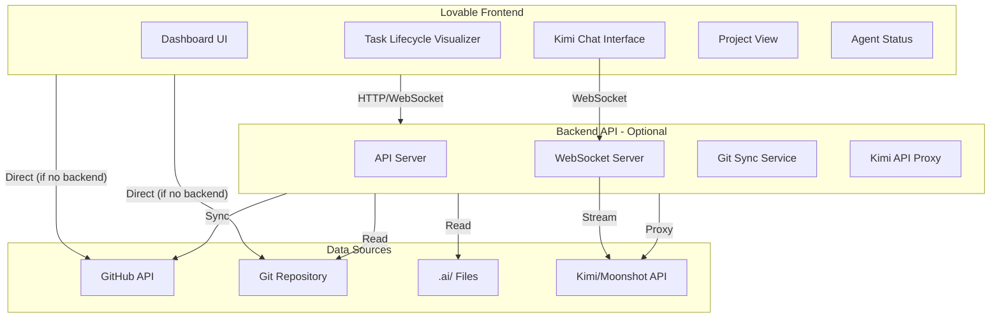

#Concept 1: Open Artel Dashboard — Central Hub

## Overview

A standalone Lovable project (separate repo) that serves as a central hub for monitoring and managing Open Artel projects. Provides real-time visualization of task lifecycles, agent conversations, project progress, and interactive chat with Kimi overseer.

## Architecture




## Tech Stack

- **Frontend**: React 18 + TypeScript 5 + Vite 5 + Tailwind 3 + shadcn/ui
- **State**: React Query (server state) + Zustand (client state)
- **Real-time**: WebSocket (Socket.io or native WebSocket)
- **Backend** (optional): Node.js + Express + WebSocket server
- **Data Access**: GitHub API, Git file reading, Moonshot API (via proxy)
- **Visualization**: Recharts or D3.js for task lifecycle diagrams

## Core Features

### 1. Project Dashboard

**Views**:

- **Project List**: All Open Artel projects (from GitHub org or configured repos)
- **Project Detail**: Single project view with:
- Current sprint status
- Active tasks
- Agent activity
- Recent commits
- Health metrics

**Data Sources**:

- GitHub API (repo info, commits, branches)
- `.ai/status.md` (parsed via GitHub API or direct file read)
- `.ai/tasks/` directory (task list)
- `.ai/reports/` (sprint summaries)

### 2. Task Pipeline View

**Features**:

- Kanban board: PENDING → IN_PROGRESS → REVIEW → DONE
- Task cards show: ID, title, assigned agent, status, dependencies
- Filter by agent, sprint, status
- Drag-and-drop status updates (if permissions allow)

**Data Source**:

- `.ai/status.md` Active Sprint table
- `.ai/tasks/*.md` files for task details

### 3. Task Lifecycle Visualizer (Streaming)

**Real-time visualization** showing:

- **Timeline view**: Horizontal timeline of task progression
- **Agent activity**: Who worked on it, when
- **Commit stream**: Commits with routing headers visualized
- **Conversation flow**: Agent-to-agent communication (from `.ai/chats/`)
- **Review feedback**: Review files and approval/rejection flow
- **File changes**: Git diff visualization

**Streaming updates**:

- WebSocket connection to backend
- Backend watches Git repo (via file system or GitHub webhooks)
- Pushes updates when:
- New commits arrive
- Task status changes
- Reviews are created
- Agent conversations happen

**Visualization components**:

- Timeline with milestones (Created, Assigned, Started, Submitted, Reviewed, Approved, Merged)
- Agent avatars/icons showing who did what
- Commit nodes with expandable details
- Conversation bubbles for agent chats
- Review cards showing feedback
- File change indicators

### 4. Kimi Chat Interface

**Features**:

- WebSocket connection for real-time streaming
- Chat history (persisted in backend or local storage)
- Project context awareness (which project you're viewing)
- Task context (can reference current task)
- Streaming responses (see Kimi's response as it's generated)

**Implementation**:

- Frontend: WebSocket client
- Backend: WebSocket server that proxies to Kimi API
- Security: API key stored in backend, never exposed to frontend
- Streaming: Forward SSE from Kimi API to WebSocket to frontend

### 5. Agent Status View

**Shows**:

- Active agents (Claude, Cursor, Lovable, Kimi)
- Current tasks per agent
- Recent activity (commits, reviews, reports)
- Agent health (session status, context size for Kimi)

**Data Sources**:

- `.ai/instructions/` (active assignments)
- `.ai/sessions/active/` (Kimi sessions)
- Git commit history (agent activity)
- `.ai/metrics/` (context optimization data)

### 6. Roadmap View

**Features**:

- Sprint timeline
- Task dependencies graph
- Progress indicators
- Milestone markers

**Data Sources**:

- `.ai/status.md` sprint information
- `.ai/tasks/*.md` dependency information
- `.ai/reports/` historical data

### 7. Git History & Development Log

**Features**:

- Commit timeline with routing headers parsed
- Branch visualization
- Agent activity heatmap
- Development log (aggregated from commits, reviews, reports)

**Data Sources**:

- GitHub API (commits, branches)
- `.ai/reviews/` (review history)
- `.ai/reports/` (sprint summaries)

### 8. Project Workforce View

**Shows**:

- Agent Skills (`.agents/skills/`)
- Agent configurations (`.agents/*.yaml`)
- Session metadata (`.ai/sessions/`)
- Context metrics (`.ai/metrics/`)
- Uploaded files (`.ai/metrics/uploaded-files.json`)

## Implementation Tasks

### Task D1.1: Project Setup

1. **Create Lovable project**:

- React + TypeScript + Vite + Tailwind + shadcn/ui
- Install dependencies: React Query, Zustand, Socket.io-client, Recharts
- Set up routing (React Router)

2. **Project structure**:
   ```javascript
            src/
            ├── components/
            │   ├── ui/              # shadcn/ui components
            │   ├── dashboard/       # Dashboard components
            │   ├── tasks/           # Task-related components
            │   ├── agents/          # Agent status components
            │   ├── chat/            # Kimi chat components
            │   └── visualization/   # Task lifecycle visualizer
            ├── pages/
            │   ├── Dashboard.tsx
            │   ├── ProjectDetail.tsx
            │   ├── TaskPipeline.tsx
            │   ├── TaskLifecycle.tsx
            │   ├── Agents.tsx
            │   ├── Roadmap.tsx
            │   └── Chat.tsx
            ├── hooks/
            │   ├── useGitHub.ts
            │   ├── useKimiChat.ts
            │   ├── useTaskStream.ts
            │   └── useWebSocket.ts
            ├── services/
            │   ├── github.ts
            │   ├── kimi.ts
            │   └── websocket.ts
            ├── stores/
            │   ├── projectStore.ts
            │   ├── taskStore.ts
            │   └── chatStore.ts
            └── types/
                ├── project.ts
                ├── task.ts
                └── agent.ts
   ```


### Task D1.2: Backend API (Optional but Recommended)

1. **Create Node.js backend**:

- Express server
- WebSocket server (Socket.io)
- GitHub API client
- Kimi API proxy
- Git file reader

2. **Endpoints**:

- `GET /api/projects` — List projects
- `GET /api/projects/:id` — Project details
- `GET /api/projects/:id/tasks` — Task list
- `GET /api/projects/:id/tasks/:taskId` — Task details
- `GET /api/projects/:id/tasks/:taskId/lifecycle` — Task lifecycle data
- `GET /api/projects/:id/agents` — Agent status
- `GET /api/projects/:id/commits` — Commit history
- `WS /ws` — WebSocket connection for real-time updates
- `WS /ws/kimi` — WebSocket for Kimi chat

3. **WebSocket events**:

- `task:update` — Task status changed
- `commit:new` — New commit detected
- `review:new` — New review created
- `chat:message` — Kimi chat message (streaming)

### Task D1.3: GitHub API Integration

1. **GitHub API client**:

- Authentication (Personal Access Token or OAuth)
- List repositories (filter by Open Artel projects)
- Get commits, branches, files
- Parse commit messages for routing headers
- Read `.ai/` files via GitHub Contents API

2. **Data parsing**:

- Parse `.ai/status.md` (markdown table)
- Parse `.ai/tasks/*.md` (task briefs)
- Parse `.ai/reviews/*.md` (review feedback)
- Parse `.ai/reports/*.md` (sprint summaries)

### Task D1.4: Task Lifecycle Visualizer

1. **Data collection**:

- Task creation (from `.ai/tasks/`)
- Assignment (from `.ai/instructions/`)
- Commits (from Git history)
- Reviews (from `.ai/reviews/`)
- Status changes (from `.ai/status.md` history)

2. **Visualization components**:

- Timeline component (horizontal scrollable)
- Milestone markers
- Agent activity nodes
- Commit nodes (expandable)
- Conversation flow
- Review cards

3. **Streaming updates**:

- WebSocket connection
- Real-time updates as events happen
- Smooth animations for new events

### Task D1.5: Kimi Chat Interface

1. **WebSocket chat client**:

- Connect to backend WebSocket
- Send messages
- Receive streaming responses
- Display conversation history

2. **Backend WebSocket handler**:

- Accept chat messages
- Proxy to Kimi API (Moonshot API)
- Stream responses back to client
- Handle errors gracefully

3. **Context awareness**:

- Include project context in prompts
- Include current task context (if viewing task)
- Include recent commits/reviews

### Task D1.6: Project Configuration

1. **Project selection**:

- List of GitHub repos (manually configured or auto-discovered)
- Project settings (API keys, paths)
- Local project support (if dashboard is integrated)

2. **Authentication**:

- GitHub OAuth (for GitHub API access)
- API key management (for Kimi, stored securely in backend)

### Task D1.7: Documentation

1. **Setup guide**:

- How to create the Lovable project
- How to configure backend (if used)
- How to connect to projects
- How to set up authentication

2. **Usage guide**:

- How to use each view
- How to interact with Kimi chat
- How to interpret task lifecycle visualization

## Success Metrics

- [ ] Dashboard loads and displays project list
- [ ] Task pipeline view shows tasks from `.ai/status.md`
- [ ] Task lifecycle visualizer displays complete task history
- [ ] Real-time updates work (new commits trigger visualization updates)
- [ ] Kimi chat works with streaming responses
- [ ] All views are responsive and performant
- [ ] Documentation complete

## Design Decisions

1. **Standalone project**: Easier to maintain, can monitor multiple projects
2. **Hybrid data access**: GitHub API for most data, direct file reading for local projects