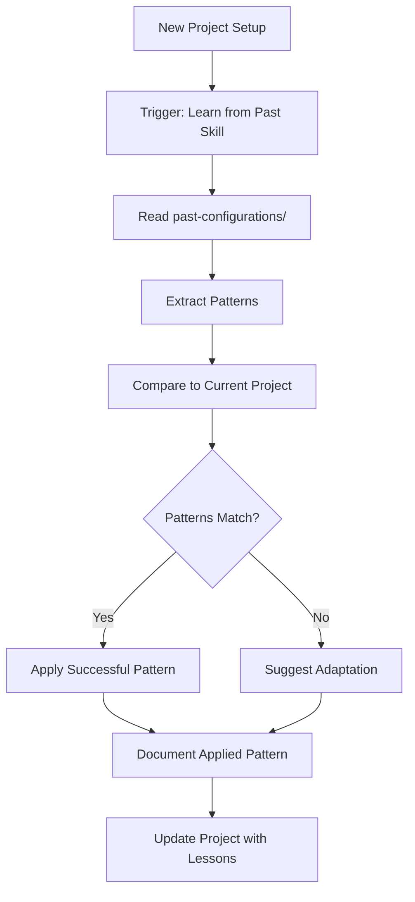

# F1: Learn from Past Configurations Implementation

## Problem Statement

We have `past-configurations/Even-Openclaw/` with real project data (30+ tasks, 4 phases, boundaries, status, tasks, templates), but agents never reference it when starting new projects. This means:

- Agents repeat mistakes that were already solved
- Agents don't leverage successful patterns
- Agents don't learn from project structure decisions
- Each new project starts from scratch without institutional knowledge

## Solution Overview

A skill that:

1. Instructs agents to study past configurations before project setup
2. Extracts lessons (successful patterns, failed patterns, anti-patterns)
3. Compares current project structure to past ones
4. Applies successful patterns and avoids failed ones
5. Documents lessons learned for future reference

## Architecture




## Implementation Tasks

### Task F1.1: Create Learn from Past Skill

**File**: `.agents/skills/learn-from-past/SKILL.md`**Type**: Standard skill (not a flow)**Purpose**: Instructs agents on how to study past configurations and apply lessons**Content**:

- When to use (project bootstrap, major refactors, new features)
- What to read (past-configurations/ structure)
- How to extract patterns (successful vs failed)
- How to compare (current vs past structure)
- How to apply (adapt patterns to current context)
- How to document (lessons learned file)

### Task F1.2: Create Past Configuration Index

**File**: `past-configurations/INDEX.md`**Purpose**: Catalog of available past configurations with metadata**Structure**:

```markdown
# Past Configurations Index

## Even-Openclaw

- **Project Type**: Full-stack (React + Supabase + Flutter + OpenClaw plugin)
- **Phases**: 4 (P1 Proof of Concept, P2 Frontend, P3 Real Data, P4 Gateway)
- **Tasks**: 30+ tasks completed
- **Key Files**:
        - `boundaries.md` — File ownership map
        - `status.md` — Sprint tracking with phases
        - `tasks/` — 30+ task briefs
        - `project-vision/README.md` — Architecture vision
        - `CURSOR_WORKFORCE.md` — Workforce protocol
- **Lessons Learned**: See `LESSONS.md`
- **When to Reference**: React + Supabase projects, multi-target builds, OpenClaw integration
```

**Future**: Add more past configurations as they become available

### Task F1.3: Create Lessons Learned Extractor

**File**: `scripts/extract-past-lessons.sh`**Purpose**: Analyze past configuration and extract structured lessons**Functionality**:

1. Read past configuration directory (e.g., `past-configurations/Even-Openclaw/`)
2. Analyze key files:

- `status.md` — What phases succeeded/failed?
- `tasks/` — Which tasks had issues? Which were smooth?
- `boundaries.md` — What file ownership patterns worked?
- Review files (if available) — What got rejected and why?

3. Extract patterns:

- **Successful patterns**: What worked well (e.g., phased approach, specific task structure)
- **Failed patterns**: What caused problems (e.g., unclear boundaries, task dependencies)
- **Anti-patterns**: What to avoid (e.g., too-large tasks, missing acceptance criteria)

4. Output structured JSON or Markdown

**Usage**:

```bash
./scripts/extract-past-lessons.sh Even-Openclaw
# Output: .ai/lessons/even-openclaw-lessons.md
```

**Output format**:

```markdown
# Lessons Learned: Even-Openclaw

## Successful Patterns

1. **Phased Approach**
            - Pattern: Break work into phases (P1, P2, P3, P4)
            - Evidence: All 4 phases completed successfully
            - Application: Use for complex multi-target projects

2. **Clear File Ownership**
            - Pattern: Explicit boundaries.md with every file mapped
            - Evidence: Zero boundary violations in reviews
            - Application: Always generate boundaries.md during bootstrap

## Failed Patterns

1. **Unclear Task Dependencies**
            - Pattern: Tasks with circular or missing dependencies
            - Evidence: TASK-XXX had to be re-scoped
            - Avoid: Always validate dependency graph before assignment

2. **Missing Acceptance Criteria**
            - Pattern: Tasks without testable criteria
            - Evidence: Review rejections for incomplete tasks
            - Avoid: Require acceptance criteria in all task briefs

## Anti-Patterns

1. **Too-Large Tasks**
            - Pattern: Tasks spanning multiple phases
            - Evidence: TASK-XXX took 3 review cycles
            - Avoid: Keep tasks to single-session scope
```


### Task F1.4: Create Project Structure Comparator

**File**: `scripts/compare-project-structure.sh`**Purpose**: Compare current project structure to past configurations**Functionality**:

1. Read current project structure (AGENTS.md, boundaries.md, .ai/ structure)
2. Read past configuration structure
3. Compare:

- File ownership patterns (boundaries.md)
- Task structure (templates, task format)
- Agent roles (AGENTS.md)
- Coordination layer (.ai/ structure)

4. Identify similarities and differences
5. Suggest adaptations from past patterns

**Usage**:

```bash
./scripts/compare-project-structure.sh Even-Openclaw
# Output: .ai/reports/structure-comparison-even-openclaw.md
```

**Output format**:

```markdown
# Project Structure Comparison: Current vs Even-Openclaw

## Similarities

- Both use React + Supabase stack
- Both have multi-target builds (web + mobile)
- Both use phased approach

## Differences

- Current: Single target (web only)
- Even-Openclaw: Multi-target (web + Flutter + plugin)

## Suggested Adaptations

1. **File Ownership**: Even-Openclaw's boundaries.md pattern worked well — apply similar structure
2. **Task Format**: Even-Openclaw's task template had clear acceptance criteria — use same format
3. **Phased Approach**: Even-Openclaw's phase structure (P1, P2, P3, P4) worked — consider for complex features
```


### Task F1.5: Enhance Bootstrap Playbook

**Modification**: `setups/multi-agent-starter/BOOTSTRAP_PLAYBOOK.md`**Add step**: "Phase 0: Learn from Past Configurations"**Content**:

```markdown
### Phase 0: Learn from Past Configurations

Before customizing the starter kit, study past configurations to learn from real project experience:

1. **Read past configuration index**: `past-configurations/INDEX.md`
2. **Identify relevant past configs**: Match your project type (stack, complexity, goals)
3. **Extract lessons**: Run `./scripts/extract-past-lessons.sh <config-name>`
4. **Compare structure**: Run `./scripts/compare-project-structure.sh <config-name>`
5. **Apply lessons**: Use successful patterns, avoid failed patterns
6. **Document**: Create `.ai/lessons/applied-lessons.md` with what you learned

**Example**:
- If building React + Supabase: Study `Even-Openclaw`
- If building multi-target: Study `Even-Openclaw` (web + Flutter + plugin)
- If building simple web app: Still study `Even-Openclaw` for task structure patterns

**Key files to read from past configs**:
- `boundaries.md` — How file ownership was structured
- `status.md` — How sprints were organized
- `tasks/TASK-*.md` — What task format worked
- `project-vision/README.md` — How architecture was documented
```


### Task F1.6: Create Applied Lessons Tracker

**File**: `.ai/lessons/applied-lessons.md`**Purpose**: Document which lessons from past configs were applied to current project**Structure**:

```markdown
# Applied Lessons from Past Configurations

**Project**: [Current Project Name]
**Date**: [YYYY-MM-DD]
**Source Configs**: [Even-Openclaw, ...]

## Applied Successful Patterns

1. **Phased Approach**
            - Source: Even-Openclaw
            - Applied: Using P1, P2, P3 structure for feature rollout
            - Result: [To be filled after implementation]

2. **Clear File Ownership**
            - Source: Even-Openclaw
            - Applied: Generated comprehensive boundaries.md during bootstrap
            - Result: [To be filled after implementation]

## Avoided Failed Patterns

1. **Unclear Task Dependencies**
            - Source: Even-Openclaw
            - Avoided: Validating dependency graph before task assignment
            - Result: [To be filled after implementation]

## Adaptations Made

1. **Simplified Boundaries**
            - Source: Even-Openclaw (multi-target)
            - Adaptation: Single-target project, simpler boundaries
            - Rationale: Don't need Flutter/plugin boundaries
```


### Task F1.7: Update Overseer Prompt

**Modification**: `.agents/prompts/overseer.md`**Add section**: "Learning from Past Configurations"**Content**:

- When starting a new project or major feature, study `past-configurations/`
- Use `extract-past-lessons.sh` to get structured lessons
- Use `compare-project-structure.sh` to compare current vs past
- Apply successful patterns, avoid failed patterns
- Document applied lessons in `.ai/lessons/applied-lessons.md`

### Task F1.8: Create Lessons Directory Structure

**Directory**: `.ai/lessons/`**Structure**:

```javascript
.ai/lessons/
├── applied-lessons.md          # What was applied to current project
├── even-openclaw-lessons.md    # Extracted from Even-Openclaw
└── [future-config]-lessons.md  # Extracted from other past configs
```


### Task F1.9: Enhance Task Assignment

**Modification**: `.agents/skills/sprint-execution/SKILL.md`**Add step**: "Check Past Lessons"**Content**:

- Before decomposing sprint goals, check `.ai/lessons/applied-lessons.md`
- If similar work was done in past configs, reference those patterns
- Avoid patterns marked as "failed" in lessons
- Apply patterns marked as "successful"

### Task F1.10: Create Pattern Library

**File**: `.ai/patterns/from-past-configs/`**Purpose**: Reusable patterns extracted from past configurations**Structure**:

```javascript
.ai/patterns/from-past-configs/
├── phased-approach.md          # How to structure phases
├── file-ownership-mapping.md   # How to map boundaries
├── task-decomposition.md        # How to break down work
└── [pattern-name].md            # Other patterns
```

**Each pattern file**:

```markdown
# Pattern: [Name]

**Source**: Even-Openclaw (or other past config)
**Category**: [Structure | Process | Task | Review]

## Description

[What the pattern is]

## Evidence

[Why it worked or didn't work]

## When to Use

[When this pattern applies]

## How to Apply

[Step-by-step instructions]

## Variations

[How to adapt for different contexts]
```


### Task F1.11: Create Test Suite

**File**: `scripts/test-learn-from-past.sh`**Tests**:

1. Extract lessons script execution (dry-run)
2. Structure comparison script execution
3. Lessons file format validation
4. Pattern library structure validation
5. Integration with bootstrap playbook
6. Edge cases (no past configs, invalid config, missing files)

**Test count**: ~12 tests (structural + live API + edge + integration)

## Detailed Design

### Lesson Extraction Process

**Step 1: Read Past Configuration**

- Read `past-configurations/<config-name>/`
- Identify key files: `status.md`, `boundaries.md`, `tasks/`, `project-vision/`

**Step 2: Analyze Success Metrics**

- Count completed vs failed tasks
- Identify phases that succeeded
- Count review rejections
- Identify boundary violations

**Step 3: Extract Patterns**

- **Successful**: Patterns that led to success (e.g., phased approach, clear boundaries)
- **Failed**: Patterns that caused problems (e.g., unclear dependencies, missing criteria)
- **Anti-patterns**: What to avoid (e.g., too-large tasks, circular dependencies)

**Step 4: Structure Output**

- Write to `.ai/lessons/<config-name>-lessons.md`
- Use consistent format for easy comparison

### Structure Comparison Process

**Step 1: Read Current Project**

- Read `AGENTS.md`, `boundaries.md`, `.ai/` structure
- Extract: tech stack, agent roles, file ownership, task format

**Step 2: Read Past Configuration**

- Read same files from past config
- Extract same metadata

**Step 3: Compare**

- Similarities: What matches (stack, structure, patterns)
- Differences: What's different (scope, complexity, targets)
- Gaps: What current project is missing that past had

**Step 4: Suggest Adaptations**

- If similar: Apply successful patterns directly
- If different: Adapt patterns to current context
- If gaps: Suggest adding missing elements

### Integration Points

1. **Bootstrap Process**:

- Run lesson extraction before customization
- Run structure comparison during analysis
- Apply lessons during customization

2. **Sprint Planning**:

- Check applied lessons before decomposing goals
- Reference successful patterns from past configs
- Avoid failed patterns

3. **Task Assignment**:

- Check if similar tasks were done in past configs
- Reference task structure that worked
- Avoid task patterns that caused issues

4. **Review Process**:

- Compare current review patterns to past
- Apply review criteria that worked
- Avoid review patterns that were too strict/lenient

## Success Metrics

- [ ] Lessons extracted from Even-Openclaw
- [ ] Structure comparison works for current project
- [ ] Bootstrap playbook includes past config study
- [ ] Applied lessons documented
- [ ] Pattern library created with reusable patterns
- [ ] Agents reference past configs when starting new work
- [ ] Successful patterns applied, failed patterns avoided

## Design Decisions

1. **Structured extraction**: Use scripts to extract lessons (not manual)
2. **Pattern library**: Reusable patterns in `.ai/patterns/from-past-configs/`
3. **Applied lessons tracking**: Document what was actually used
4. **Opt-in**: Study past configs is recommended but not required
5. **Future-proof**: Structure supports multiple past configs

## Testing Strategy

1. **Structural tests**: Validate script syntax, output format, directory structure
2. **Live API tests**: Run extraction on real Even-Openclaw config, verify output
3. **Edge tests**: No past configs, invalid config name, missing files
4. **Integration tests**: Full flow (bootstrap → extract → compare → apply)

## Future Enhancements

1. **Automated pattern detection**: Use AI to identify patterns automatically