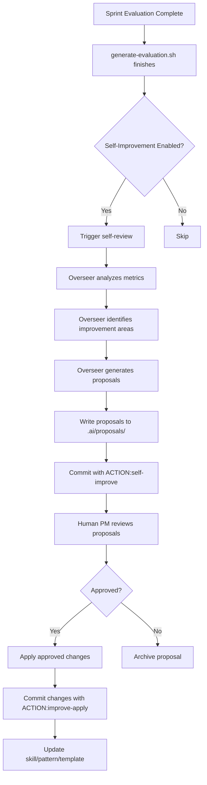

# F2: Self-Improvement Loop Implementation

## Problem Statement

After each sprint, agents could propose improvements to their own skills/patterns/templates, but there is no structured process for this. The overseer has access to evaluation metrics and review patterns but cannot systematically learn from them and improve its own capabilities.

## Solution Overview

A self-improvement loop that:

1. Triggers automatically after sprint evaluation completes
2. Analyzes overseer performance using evaluation metrics and review patterns
3. Proposes specific improvements to skills, patterns, or templates
4. Submits proposals for human PM review
5. Commits approved changes automatically

## Architecture




## Implementation Tasks

### Task F2.1: Create Proposal Template

**File**: `.ai/templates/improvement-proposal.md`**Structure**:

- Proposal metadata (ID, date, sprint, proposer)
- Improvement category (skill, pattern, template, automation)
- Problem statement (what metric/pattern indicates need)
- Proposed change (specific file and modification)
- Rationale (why this improves performance)
- Expected impact (which metrics should improve)
- Risk assessment (what could break)
- Implementation details (exact changes needed)

**Format**: Markdown with YAML frontmatter for metadata

### Task F2.2: Create Self-Review Skill

**File**: `.agents/skills/self-improvement/SKILL.md`**Type**: Flow skill**Process**:

1. Read latest evaluation report (`.ai/reports/eval-sprint-*.md`)
2. Analyze metrics that are FAIL or NEEDS WORK
3. Read review files to identify recurring patterns
4. Compare current skills/patterns against observed issues
5. Generate improvement proposals
6. Write proposals to `.ai/proposals/`

**Inputs**:

- Evaluation report
- Review files (`.ai/reviews/`)
- Current skills (`.agents/skills/`)
- Current patterns (`.ai/patterns/`)
- Current templates (`.agents/subagents/`, `setups/`)

**Outputs**:

- Proposal files (`.ai/proposals/PROPOSAL-XXX.md`)

### Task F2.3: Create Proposal Directory Structure

**Directory**: `.ai/proposals/`**Structure**:

```javascript
.ai/proposals/
├── active/          # Pending human review
├── approved/        # Approved, ready to apply
├── rejected/        # Rejected by human PM
└── applied/         # Applied and committed
```

**Naming**: `PROPOSAL-YYYYMMDD-HHMMSS-<category>-<short-name>.md`**Example**: `PROPOSAL-20260210-143022-skill-code-review-enhancement.md`

### Task F2.4: Enhance generate-evaluation.sh

**Modification**: `scripts/generate-evaluation.sh`**Add**:

- Flag: `--self-improve` (default: false)
- After report generation, if `--self-improve` is set:
- Call Kimi with self-review prompt
- Trigger self-improvement skill
- Generate proposals

**Integration point**: After `generate_kimi_report()` completes successfully**Command**: `./scripts/generate-evaluation.sh --self-improve`

### Task F2.5: Create Self-Review Script

**File**: `scripts/self-improvement-review.sh`**Purpose**: Standalone script to trigger self-review (can be called manually or by evaluation script)**Functionality**:

1. Read latest evaluation report
2. Call Kimi with self-review prompt
3. Parse proposals from Kimi output
4. Write proposal files to `.ai/proposals/active/`
5. Commit with `[AGENT:kimi] [ACTION:self-improve] [TASK:SPRINT-REVIEW]`

**Usage**:

```bash
./scripts/self-improvement-review.sh [--sprint N] [--evaluation-file PATH]
```


### Task F2.6: Create Proposal Application Script

**File**: `scripts/apply-improvement-proposal.sh`**Purpose**: Apply an approved proposal to the codebase**Functionality**:

1. Read proposal file
2. Parse implementation details
3. Apply changes to target file (skill, pattern, or template)
4. Validate changes (syntax check, structure check)
5. Commit with `[AGENT:kimi] [ACTION:improve-apply] [TASK:PROPOSAL-XXX]`
6. Move proposal to `.ai/proposals/applied/`

**Usage**:

```bash
./scripts/apply-improvement-proposal.sh .ai/proposals/approved/PROPOSAL-XXX.md
```


### Task F2.7: Enhance Post-Commit Hook

**Modification**: `scripts/post-commit`**Add handler for `[ACTION:self-improve]`**:

- Log the self-improvement trigger
- Optionally notify human PM (via instruction file)

**Add handler for `[ACTION:improve-apply]`**:

- Log the application
- Optionally trigger validation tests

### Task F2.8: Create Human Review Workflow

**File**: `.ai/templates/proposal-review.md`**Purpose**: Template for human PM to review proposals**Structure**:

- Proposal summary
- Review checklist
- Approval/rejection decision
- Notes/comments

**Process**:

1. Human PM reads proposal from `.ai/proposals/active/`
2. Human PM reviews using template
3. Human PM commits decision:

- `[AGENT:human] [ACTION:approve] [TASK:PROPOSAL-XXX] `→ Move to `approved/`
- `[AGENT:human] [ACTION:reject] [TASK:PROPOSAL-XXX] `→ Move to `rejected/`

### Task F2.9: Update Overseer Prompt

**Modification**: `.agents/prompts/overseer.md`**Add section**: "Self-Improvement Responsibilities"**Content**:

- When to trigger self-review (after evaluation)
- How to analyze metrics
- How to identify improvement opportunities
- How to write proposals
- How to apply approved proposals

### Task F2.10: Create Test Suite

**File**: `scripts/test-self-improvement.sh`**Tests**:

1. Proposal template structure validation
2. Self-review script execution (dry-run)
3. Proposal parsing and file creation
4. Proposal application script (with mock proposal)
5. Integration with evaluation script
6. Post-commit hook routing for new actions
7. Edge cases (no evaluation report, invalid proposal format, etc.)

**Test count**: ~15 tests (structural + live API + edge)

## Detailed Design

### Proposal Format

````markdown
---
proposal_id: PROPOSAL-20260210-143022-skill-code-review
category: skill
target_file: .agents/skills/code-review/SKILL.md
sprint: 3
date: 2026-02-10
proposer: kimi-overseer
status: pending
---

# Improvement Proposal: Enhanced Security Checks in Code Review

## Problem Statement

Evaluation metrics show:
- Security issues found post-merge: 2 instances
- Review rejection rate: 25% (target: <30%, but trending up)
- Review files show no explicit security audit step

**Root cause**: The `code-review` skill checks boundaries and acceptance criteria but does not specifically audit for security vulnerabilities.

## Proposed Change

Add a new step to `.agents/skills/code-review/SKILL.md`:

**New step**: "Check for security issues"
- Scan for exposed secrets (API keys, tokens, passwords)
- Check for injection vulnerabilities (SQL, XSS, command injection)
- Check for insecure dependencies (known CVEs)
- Check for insecure configurations (CORS, headers, auth)

**Location**: After "Check for regressions" step, before "Check commit message format"

## Rationale

1. **Metric alignment**: Addresses the 2 post-merge security issues
2. **Prevention**: Catches security issues before merge, reducing regression rate
3. **Completeness**: Makes code-review skill comprehensive (boundaries + criteria + security)

## Expected Impact

- **Regression rate**: Should decrease (fewer post-merge security fixes)
- **Review quality**: Should improve (more thorough reviews)
- **Review rejection rate**: May increase slightly (more checks = more rejections), but this is acceptable for security

## Risk Assessment

- **Low risk**: Adding a new step does not break existing review flow
- **Potential delay**: Security checks may add 1-2 minutes to review time
- **Mitigation**: Security checks can run in parallel with other checks

## Implementation Details

1. Add new step section to SKILL.md:
   ```markdown
   ### Step: Check for security issues
    - Scan code for exposed secrets (regex patterns for API keys, tokens)
    - Check for SQL injection patterns (string concatenation in queries)
    - Check for XSS patterns (unsanitized user input in HTML)
    - Check package.json for dependencies with known CVEs
    - Check for insecure configurations (CORS: *, no auth headers)
   ```

2. Update the Mermaid flowchart to include security check node

3. Add security findings to review template (`.ai/templates/review.md`)

## Files to Modify

- `.agents/skills/code-review/SKILL.md` (add security step)
- `.ai/templates/review.md` (add security findings section)

## Dependencies

None — this is a self-contained improvement to an existing skill.
````


### Self-Review Prompt

```markdown
You are the Kimi Overseer performing a self-review after sprint evaluation.

**Your task**: Analyze your own performance and propose improvements to your skills, patterns, and templates.

**Inputs**:
1. Latest evaluation report: .ai/reports/eval-sprint-*.md
2. Review files: .ai/reviews/*.md
3. Current skills: .agents/skills/
4. Current patterns: .ai/patterns/
5. Current templates: .agents/subagents/

**Analysis process**:
1. Read the evaluation report and identify metrics that are FAIL or NEEDS WORK
2. Read review files to identify recurring patterns (what gets rejected repeatedly? what feedback is common?)
3. Compare current skills/patterns against observed issues
4. Identify specific improvements that would address the metrics

**Output**:
Generate 1-3 improvement proposals (prioritize highest impact). Write each proposal to:
.ai/proposals/active/PROPOSAL-YYYYMMDD-HHMMSS-<category>-<name>.md

Use the template from .ai/templates/improvement-proposal.md

**Focus areas**:
- Skills that could prevent recurring issues
- Patterns that could streamline workflows
- Templates that could improve consistency
- Automation that could reduce manual work

**Constraints**:
- Proposals must be specific and actionable
- Proposals must include implementation details
- Proposals must assess risk
- Do not propose changes that would break existing functionality
```


### Integration with Evaluation

**Option 1: Automatic trigger**

- Add `--self-improve` flag to `generate-evaluation.sh`
- After report generation, automatically trigger self-review
- Default: off (human must opt-in)

**Option 2: Manual trigger**

- Human runs `self-improvement-review.sh` after reviewing evaluation
- More control, but requires manual step

**Recommendation**: Option 1 with flag (opt-in automatic)

### Human Review Process

1. **Notification**: After proposals are generated, create instruction file:

- `.ai/instructions/human-review-proposals.md`
- Lists all pending proposals with summaries

2. **Review**: Human PM reads proposals and reviews using template
3. **Decision**: Human PM commits decision:

- `[AGENT:human] [ACTION:approve] [TASK:PROPOSAL-XXX] `→ Move to `approved/`
- `[AGENT:human] [ACTION:reject] [TASK:PROPOSAL-XXX] `→ Move to `rejected/`

4. **Application**: Approved proposals are applied via `apply-improvement-proposal.sh`

### Proposal Categories

1. **Skill improvements**: Enhance existing skills (add steps, clarify instructions)
2. **Pattern additions**: Create new patterns for recurring scenarios
3. **Template updates**: Update subagent templates or starter kit templates
4. **Automation enhancements**: Add new scripts or GitHub Actions

## Success Metrics

- [ ] Self-review triggers after evaluation (when enabled)
- [ ] Proposals generated with correct format
- [ ] Human can review and approve/reject proposals
- [ ] Approved proposals are applied correctly
- [ ] Applied proposals improve metrics in next sprint
- [ ] No regressions from applied proposals

## Design Decisions

1. **Proposal format**: Markdown with YAML frontmatter for structured metadata
2. **Directory structure**: Separate folders for proposal lifecycle (active → approved → applied)
3. **Opt-in automatic**: Self-review is opt-in via flag (not forced)
4. **Human gate**: All proposals require human approval (no auto-apply)
5. **Validation**: Applied proposals are validated before commit
6. **Traceability**: All proposals are tracked in Git history

## Testing Strategy

1. **Structural tests**: Validate proposal template, directory structure, script syntax
2. **Live API tests**: Run self-review script with real evaluation report, verify Kimi generates proposals
3. **Edge tests**: No evaluation report, invalid proposal format, circular dependencies
4. **Integration tests**: Full flow (evaluation → self-review → proposal → approval → apply)

## Future Enhancements

1. **Learning from past proposals**: Track which proposals improved metrics, prioritize similar proposals