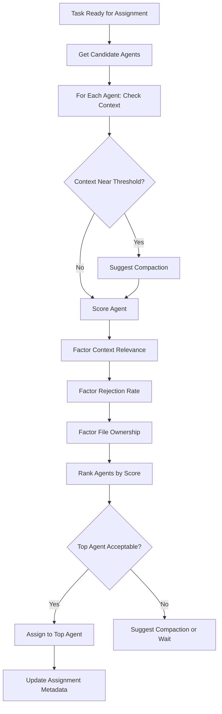
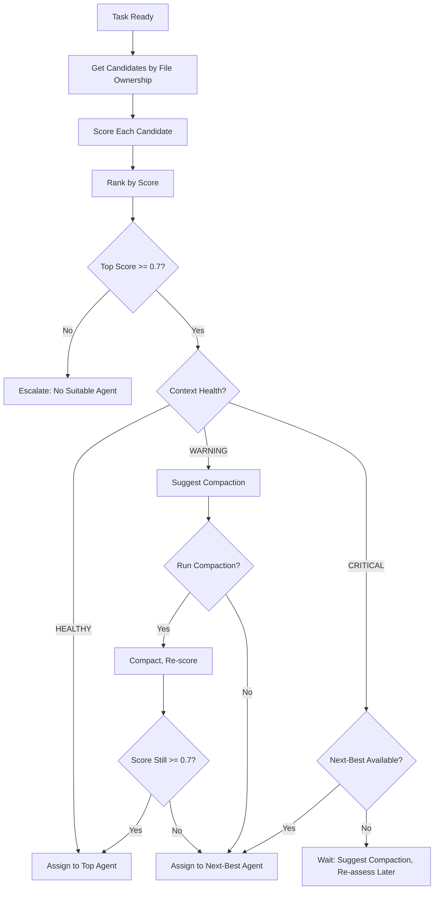

# F3: Context-Aware Task Assignment Implementation

## Problem Statement

Current task assignment is based solely on file ownership (boundaries), ignoring:

- Agent's current session context size (may be near threshold)
- Agent's recent context (related tasks could benefit from loaded context)
- Agent's performance history (rejection rate by task type)

This leads to:

- Context overflow (agent can't load new task context)
- Wasted context (agent has relevant context but gets unrelated task)
- Poor assignments (agent with high rejection rate for task type gets assigned anyway)

## Solution Overview

A context-aware assignment system that:

1. Checks agent context state before assignment
2. Suggests compaction if context is near threshold
3. Scores agents based on context relevance and performance
4. Assigns tasks to the best-fit agent (not just file ownership)

## Architecture




## Implementation Tasks

### Task F3.1: Create Agent Performance Tracking

**File**: `.ai/metrics/agent-performance.json`**Structure**: Track per-agent, per-task-type metrics

```json
{
  "cursor": {
    "task_types": {
      "Create": {"total": 10, "approved": 8, "rejected": 2, "rejection_rate": 0.20},
      "Modify": {"total": 15, "approved": 14, "rejected": 1, "rejection_rate": 0.07},
      "Fix": {"total": 5, "approved": 3, "rejected": 2, "rejection_rate": 0.40},
      "Refactor": {"total": 8, "approved": 7, "rejected": 1, "rejection_rate": 0.12}
    },
    "overall": {"total": 38, "approved": 32, "rejected": 6, "rejection_rate": 0.16},
    "last_updated": "2026-02-10T14:30:00Z"
  },
  "lovable": {
    "task_types": {...},
    "overall": {...}
  },
  "claude-code": {
    "task_types": {...},
    "overall": {...}
  }
}
```

**Update triggers**:

- After review verdict (APPROVED/REJECTED)
- Tracked in post-commit hook or review completion

### Task F3.2: Create Context Relevance Analyzer

**File**: `scripts/analyze-context-relevance.sh`**Purpose**: Analyze what files/context an agent currently has loaded**Functionality**:

1. Read agent's current session context (from `kimi-context-monitor.sh`)
2. Extract file paths mentioned in context (from context.jsonl or session metadata)
3. Compare against task's required files (from task brief)
4. Calculate relevance score (0.0 to 1.0)

**Usage**:

```bash
./scripts/analyze-context-relevance.sh <agent> <task-id>
# Output: relevance_score (0.0-1.0), relevant_files_count, total_files_in_context
```

**Relevance calculation**:

- If task requires files A, B, C and agent has A, B in context → 0.67 relevance
- If task requires files X, Y and agent has A, B, C → 0.0 relevance
- If task requires files A, B and agent has A, B, C, D, E (superset) → 1.0 relevance

### Task F3.3: Create Task Assignment Scorer

**File**: `scripts/score-task-assignment.sh`**Purpose**: Score each candidate agent for a given task**Inputs**:

- Task ID
- Agent name
- Context relevance score (from F3.2)
- Agent rejection rate for task type (from F3.1)
- Context health status (from kimi-context-monitor.sh)
- File ownership match (boolean)

**Scoring formula**:

```javascript
score = (
  file_ownership_weight * (1.0 if match, 0.0 if not) +
  context_relevance_weight * context_relevance_score +
  performance_weight * (1.0 - rejection_rate) +
  context_health_weight * context_health_score
) / total_weight

Where:
- file_ownership_weight = 0.4 (must still respect boundaries)
- context_relevance_weight = 0.3 (prefer agents with relevant context)
- performance_weight = 0.2 (prefer agents with better track record)
- context_health_weight = 0.1 (penalize agents near threshold)
```

**Context health score**:

- HEALTHY (context < warn threshold) → 1.0
- WARNING (context >= warn, < critical) → 0.5
- CRITICAL (context >= critical) → 0.0

**Output**: JSON with score and breakdown**Usage**:

```bash
./scripts/score-task-assignment.sh TASK-XXX cursor
# Output: {"score": 0.85, "breakdown": {...}, "recommendation": "assign" | "compact_first" | "wait"}
```


### Task F3.4: Enhance Task Brief Template

**Modification**: `.ai/templates/task.md`**Add section**: "Files in Scope"

```markdown
### Files in Scope

- [List of specific files that will be modified/created]
- [Or directory patterns: `src/components/ui/*`, `src/hooks/use-*.ts`]
- [Required for context-aware assignment]
```

**Purpose**: Allows assignment system to match tasks to agents with relevant context

### Task F3.5: Create Context-Aware Assignment Script

**File**: `scripts/assign-task-context-aware.sh`**Purpose**: Main script that performs context-aware assignment**Functionality**:

1. Read task brief (`.ai/tasks/TASK-XXX.md`)
2. Extract task type, files in scope, priority
3. Get candidate agents (based on file ownership)
4. For each candidate:

- Check context health (via `kimi-context-monitor.sh`)
- Calculate context relevance (via `analyze-context-relevance.sh`)
- Get rejection rate (from `agent-performance.json`)
- Score assignment (via `score-task-assignment.sh`)

5. Rank agents by score
6. If top agent score is acceptable AND context is healthy:

- Assign task

7. If top agent context is WARNING:

- Suggest compaction, then assign

8. If top agent context is CRITICAL:

- Suggest compaction, wait, or assign to next-best agent

9. Write assignment decision to `.ai/reports/assignment-TASK-XXX.md`

**Usage**:

```bash
./scripts/assign-task-context-aware.sh TASK-XXX [--force-agent <agent>] [--skip-context-check]
```

**Output**:

- Assignment instruction file (`.ai/instructions/<agent>-TASK-XXX.md`)
- Assignment report (`.ai/reports/assignment-TASK-XXX.md`)
- Commit with `[AGENT:kimi] [ACTION:delegate] [TASK:TASK-XXX]`

### Task F3.6: Update Sprint Execution Skill

**Modification**: `.agents/skills/sprint-execution/SKILL.md`**Update "Assign task to agent" step**:**Before**:

- Pick highest-priority unblocked task
- Determine agent based on file ownership
- Write instruction

**After**:

- Pick highest-priority unblocked task
- Run context-aware assignment script (`assign-task-context-aware.sh`)
- If script suggests compaction:
- Run compaction for the agent
- Re-run assignment
- Write instruction with assignment rationale

### Task F3.7: Update Task Handoff Skill

**Modification**: `.agents/skills/task-handoff/SKILL.md`**Update "Assign next task" step**:**Before**:

- Pick highest-priority unblocked task
- Determine agent based on file ownership
- Write instruction

**After**:

- Pick highest-priority unblocked task
- Run context-aware assignment script
- Include context-aware rationale in instruction

### Task F3.8: Create Performance Tracking Script

**File**: `scripts/track-agent-performance.sh`**Purpose**: Update agent performance metrics after each review**Functionality**:

1. Read review file (`.ai/reviews/TASK-XXX-review.md`)
2. Extract: agent name, task type, verdict (APPROVED/REJECTED)
3. Read current `agent-performance.json`
4. Update metrics for that agent and task type
5. Write updated JSON

**Triggers**:

- Post-commit hook (on `[ACTION:approve]` or `[ACTION:reject]`)
- Manual: `./scripts/track-agent-performance.sh .ai/reviews/TASK-XXX-review.md`

**Usage**:

```bash
./scripts/track-agent-performance.sh .ai/reviews/TASK-XXX-review.md
```


### Task F3.9: Enhance Post-Commit Hook

**Modification**: `scripts/post-commit`**Add handler for review completion**:

- On `[ACTION:approve]` or `[ACTION:reject]`:
- Extract task ID from commit message
- Find review file (`.ai/reviews/TASK-XXX-review.md`)
- Call `track-agent-performance.sh` to update metrics

### Task F3.10: Create Assignment Report Template

**File**: `.ai/templates/assignment-report.md`**Structure**:

- Task ID and title
- Candidate agents evaluated
- Scoring breakdown for each agent
- Selected agent and rationale
- Context health status
- Compaction recommendation (if any)
- Performance factors considered

### Task F3.11: Update Overseer Prompt

**Modification**: `.agents/prompts/overseer.md`**Update "Task Assignment" section**:**Add**:

- Use context-aware assignment script when assigning tasks
- Check agent context health before assignment
- Prefer agents with relevant context loaded
- Consider agent performance history for task type
- Suggest compaction if context is near threshold

### Task F3.12: Create Test Suite

**File**: `scripts/test-context-aware-assignment.sh`**Tests**:

1. Agent performance tracking (update metrics, read metrics)
2. Context relevance analyzer (calculate relevance scores)
3. Task assignment scorer (score calculation, ranking)
4. Context-aware assignment script (full flow)
5. Integration with sprint-execution skill
6. Integration with task-handoff skill
7. Edge cases (no context, no performance data, all agents at threshold)

**Test count**: ~20 tests (structural + live API + edge + integration)

## Detailed Design

### Context Relevance Analysis

**Method 1: File path matching** (primary)

- Extract file paths from task brief "Files in Scope"
- Extract file paths from agent's session context (if available)
- Calculate overlap percentage

**Method 2: Directory pattern matching** (fallback)

- If task specifies `src/components/ui/*`, check if agent has any files from that directory
- Partial matches count as 0.5 relevance

**Method 3: Semantic matching** (future enhancement)

- Use task description keywords
- Match against context summary (if available)
- Requires context summarization feature

### Scoring Algorithm Details

**Base score components**:

1. **File Ownership (40% weight)**:

- Must match: 1.0
- No match: 0.0 (disqualifies agent)

2. **Context Relevance (30% weight)**:

- 1.0 = All required files in context
- 0.5 = Some required files in context
- 0.0 = No required files in context

3. **Performance (20% weight)**:

- 1.0 = 0% rejection rate for task type
- 0.5 = 50% rejection rate
- 0.0 = 100% rejection rate
- Formula: `1.0 - rejection_rate`

4. **Context Health (10% weight)**:

- 1.0 = HEALTHY (context < warn threshold)
- 0.5 = WARNING (context >= warn, < critical)
- 0.0 = CRITICAL (context >= critical)

**Final score**:

```javascript
score = (
  0.4 * file_ownership +
  0.3 * context_relevance +
  0.2 * performance +
  0.1 * context_health
)
```

**Recommendation logic**:

- `score >= 0.7` AND `context_health >= 0.5` → **assign**
- `score >= 0.7` AND `context_health < 0.5` → **compact_first** (then assign)
- `score < 0.7` AND `context_health < 0.5` → **wait** (suggest compaction, reassess later)
- `score < 0.5` → **reject** (no suitable agent, escalate)

### Assignment Decision Flow




### Performance Tracking Update

**When to update**:

- After review verdict (APPROVED/REJECTED)
- Extract from review file or commit message

**What to track**:

- Per-agent, per-task-type:
- Total tasks of this type
- Approved count
- Rejected count
- Rejection rate (rejected / total)

**Task type extraction**:

- From task brief: `Type: [Create | Modify | Fix | Refactor]`
- Default to "Modify" if not specified

**Rolling window**:

- Track last N tasks (e.g., last 20 tasks per agent)
- Or track all-time (simpler, but may not reflect recent performance)

**Recommendation**: Track all-time with last-updated timestamp. Can add rolling window later if needed.

### Integration Points

1. **Sprint Execution Skill**:

- Replace simple assignment with `assign-task-context-aware.sh`
- Handle compaction suggestions

2. **Task Handoff Skill**:

- Replace simple assignment with `assign-task-context-aware.sh`
- Include context-aware rationale in instruction

3. **Post-Commit Hook**:

- On `[ACTION:approve]` or `[ACTION:reject]`:
    - Update agent performance metrics

4. **Context Monitor**:

- Already provides context health status
- Used by assignment scorer

5. **Session Manager**:

- Already tracks active sessions
- Used to identify agent's current context

## Success Metrics

- [ ] Agent performance metrics tracked and updated
- [ ] Context relevance calculated accurately
- [ ] Assignment scores computed correctly
- [ ] Tasks assigned to agents with relevant context (when available)
- [ ] Compaction suggested when context near threshold
- [ ] Agents with better performance history preferred
- [ ] File ownership still respected (boundaries enforced)
- [ ] Assignment reports generated with rationale

## Design Decisions

1. **File ownership still primary**: 40% weight ensures boundaries are respected
2. **Context relevance secondary**: 30% weight optimizes for efficiency
3. **Performance tertiary**: 20% weight improves quality over time
4. **Context health lowest**: 10% weight (can be addressed via compaction)
5. **Compaction suggestion**: Non-blocking (can be ignored, but logged)
6. **Performance tracking**: All-time (simpler, can add rolling window later)
7. **Task type extraction**: From task brief "Type:" field

## Testing Strategy

1. **Structural tests**: Validate JSON schemas, script syntax, template formats
2. **Live API tests**: Run assignment script with real tasks, verify scoring
3. **Edge tests**: No context, no performance data, all agents at threshold, no file ownership match
4. **Integration tests**: Full flow (task ready → score → assign → track performance)

## Future Enhancements

1. **Semantic context matching**: Match task description keywords to context summary
2. **Rolling window performance**: Track last N tasks instead of all-time
3. **Task similarity scoring**: If agent worked on similar task recently, boost score