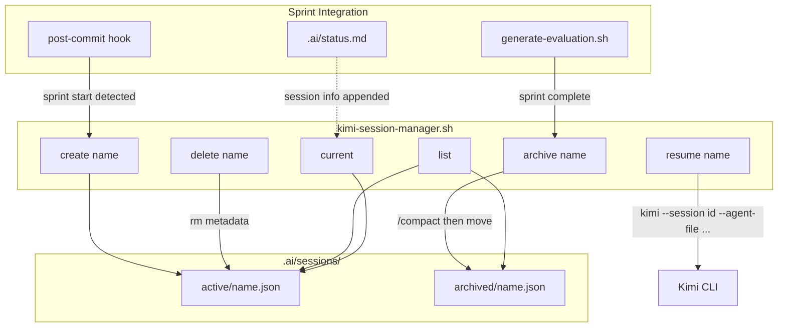

# Phase 2: Session Management Implementation Plan

## Context

Phase 1 (Tool Expansion) added SearchWeb, FetchURL, and SendDMail to the Kimi Overseer. Phase 2 builds on that by wrapping Kimi CLI's native session features (`--continue`, `--session <id>`, `/compact`) in a managed layer that ties sessions to sprints.Key Kimi CLI session facts (from [`.ai/tasks/TASK-002-research.md`](.ai/tasks/TASK-002-research.md) lines 471-479):

- Sessions auto-save to disk
- `--continue` resumes most recent session in current directory
- `--session <id>` resumes a specific session
- `/sessions` browses sessions
- `/compact` summarizes and compresses context
- 30-day inactivity timeout

The session manager script wraps these CLI features with metadata tracking, sprint integration, and archival.---

## Architecture




### Session Metadata Format (JSON)

Each session gets a metadata file in `.ai/sessions/active/` or `.ai/sessions/archived/`:

```json
{
  "name": "sprint-3",
  "kimi_session_id": "<auto-detected or user-provided>",
  "created_at": "2026-02-10T14:30:00Z",
  "sprint": "3",
  "agent_file": ".agents/kimi-overseer.yaml",
  "status": "active",
  "notes": "Sprint 3 session"
}
```

Archived sessions add:

```json
{
  "archived_at": "2026-02-15T10:00:00Z",
  "compacted": true,
  "tasks_completed": 12
}
```

---

## Implementation Tasks

### Task 2.1: Create `.ai/sessions/` directory structure

Create the storage directories and a `.gitkeep` in each:

- `.ai/sessions/active/.gitkeep`
- `.ai/sessions/archived/.gitkeep`

### Task 2.2: Create `scripts/kimi-session-manager.sh`

**File**: [`scripts/kimi-session-manager.sh`](scripts/kimi-session-manager.sh)A bash script (~250 lines) with subcommands:| Command | Behavior ||---------|----------|| `create <name> [--sprint N] `| Write metadata JSON to `.ai/sessions/active/<name>.json`. Optionally launch Kimi with `--session <name> --agent-file .agents/kimi-overseer.yaml`. || `list [--all] `| List active sessions (default) or all including archived. Read JSON files, print table. || `resume <name>` | Look up `kimi_session_id` from metadata. Run `kimi --session <id> --agent-file .agents/kimi-overseer.yaml`. || `archive <name>` | Move metadata from `active/` to `archived/`. Add `archived_at` timestamp. Optionally run `/compact` via `kimi --session <id> --print -p "/compact"` before archiving. || `delete <name>` | Remove metadata JSON from `active/` or `archived/`. Warn if session is active. || `current` | Find the most recently modified `.json` in `active/` and display it. |Key design decisions:

- Uses `jq` for JSON if available, falls back to `python3 -c "import json; ..."`, falls back to raw `echo`/`sed` for environments with neither
- Session names are sanitized (alphanumeric + hyphens only)
- All operations are idempotent where possible (creating an existing session updates it)
- Script follows the same pattern as [`scripts/install-wire-daemon.sh`](scripts/install-wire-daemon.sh) (color output, help text, subcommand routing)

### Task 2.3: Integrate sessions into sprint workflow

**Files to modify**:

1. **[`scripts/post-commit`](scripts/post-commit)** -- Add session auto-creation:

- In the `check_sprint_completion()` function (line 264), after detecting sprint completion, call `scripts/kimi-session-manager.sh archive "sprint-current"` to archive the completed sprint's session
- Add a new helper `check_sprint_start()` that detects when a new sprint instruction appears (a commit with `[ACTION:delegate]` on a fresh sprint) and calls `scripts/kimi-session-manager.sh create "sprint-<id>"`

2. **[`scripts/generate-evaluation.sh`](scripts/generate-evaluation.sh)** -- Add session info to evaluation:

- In `generate_metrics_summary()` (line 430), add a line showing the current session name if one exists
- In `generate_kimi_report()` (line 479), include session info in the Kimi prompt so the evaluation report references which session was used

3. **[`.ai/status.md`](.ai/status.md)** -- Add a "Current Session" field in the Health section that the session manager updates

### Task 2.4: Create test script `scripts/test-phase-2.sh`

A comprehensive test script following the pattern from the plan's test specifications. Includes:

- All 5 mandatory tests (create, resume, archive, list, sprint integration)
- All 5 edge tests (concurrent sessions, invalid name, corruption, large context, deletion)
- Summary with pass/fail counts
- Graceful skipping when `kimi` CLI is not installed (for CI environments)

### Task 2.5: Create documentation `docs/kimi-sessions.md`

Session management guide covering:

- What sessions are and why they matter
- How to use the session manager script
- Sprint-session lifecycle
- Troubleshooting (stale sessions, missing metadata, recovery)

---

## Success Metrics

| Metric | Target | Measurement ||--------|--------|-------------|| Session manager script | All 6 commands work | `test-phase-2.sh` mandatory tests || Session storage | Directory structure exists | `ls .ai/sessions/active/ .ai/sessions/archived/` || Sprint integration | Auto-create/archive works | Simulated sprint start/complete in tests || Documentation | Guide created | `test -f docs/kimi-sessions.md` |

## Block Removal Criteria

- [ ] All 5 mandatory tests pass
- [ ] All 5 edge tests pass
- [ ] Success metrics met (4/4)