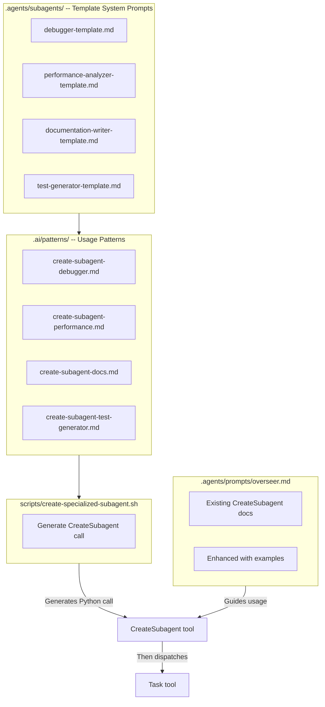

# Phase 3: Dynamic Subagent Patterns — Updated Plan

## Key Discoveries from Research

Before planning, I verified how `CreateSubagent` actually works:

1. **CreateSubagent is a runtime tool call**, not a YAML file — it takes two parameters:

- `name` (string): Unique identifier for the subagent
- `system_prompt` (string): The behavior definition (not a file path)

2. **Two-step workflow**: `CreateSubagent(...)` → `Task(subagent_name=...)`
3. **Session-scoped**: Subagents exist only for the current session (not persisted)
4. **No YAML templates needed**: Templates should be **markdown files with system prompts**, not YAML agent definitions
5. **Already documented**: Overseer prompt already has basic CreateSubagent usage (line 199-211)
6. **Existing subagents**: `reviewer-sub.yaml` and `researcher-sub.yaml` are **predefined subagents** (different from CreateSubagent — these are in the `subagents:` section of `kimi-overseer.yaml`)

**Critical distinction**:

- **Predefined subagents** (reviewer, researcher) = YAML files in `subagents:` section, dispatched via `Task(subagent_name="reviewer")`
- **Dynamic subagents** (CreateSubagent) = Runtime-created, no YAML file, dispatched via `Task(subagent_name="<created-name>")`

---

## Architecture



---

## Implementation Tasks

### Task 3.1: Create `.agents/subagents/` directory and template files

**Directory**: `.agents/subagents/` (does not exist yet)**4 template files** (Markdown, not YAML — these are system prompts):

1. **`debugger-template.md`**: System prompt for a debugging specialist subagent

- Focus: Isolate regressions, trace bugs, identify root causes
- Output format: Structured bug report with steps to reproduce, root cause, fix recommendation

2. **`performance-analyzer-template.md`**: System prompt for performance analysis

- Focus: Identify bottlenecks, analyze metrics, suggest optimizations
- Output format: Performance report with measurements, bottlenecks, recommendations

3. **`documentation-writer-template.md`**: System prompt for documentation generation

- Focus: Write clear, comprehensive docs from code analysis
- Output format: Markdown documentation following project conventions

4. **`test-generator-template.md`**: System prompt for test generation

- Focus: Generate test cases from code analysis and requirements
- Output format: Test files following project testing patterns

**Template format** (example for `debugger-template.md`):

```markdown
# Debugger Subagent Template

You are a **Debugging Specialist** subagent created dynamically by the Kimi Overseer.

## Your Mission

Isolate and diagnose bugs, regressions, and unexpected behavior in the codebase.

## Debugging Process

1. **Reproduce the issue** — Understand the symptoms and when they occur
2. **Trace execution** — Use ReadFile, Grep to follow code paths
3. **Identify root cause** — Use Think for complex reasoning
4. **Verify hypothesis** — Check related code, dependencies, recent changes
5. **Recommend fix** — Provide specific, actionable solution

## Output Format

Structure your findings as:
- **Issue Summary**: Brief description of the problem
- **Steps to Reproduce**: Numbered list
- **Root Cause**: Technical explanation
- **Affected Files**: List of files involved
- **Recommended Fix**: Specific code changes or approach
- **Prevention**: How to avoid this in the future

## Rules

- Be methodical — don't jump to conclusions
- Verify your findings with evidence
- Consider edge cases and related code paths
- Provide actionable fixes, not just diagnoses
```


### Task 3.2: Create `.ai/patterns/` directory and pattern documentation

**Directory**: `.ai/patterns/` (does not exist yet)**4 pattern files** (Markdown documentation):

1. **`create-subagent-debugger.md`**: When and how to use the debugger template
2. **`create-subagent-performance.md`**: When and how to use the performance analyzer template
3. **`create-subagent-docs.md`**: When and how to use the documentation writer template
4. **`create-subagent-test-generator.md`**: When and how to use the test generator template

**Pattern format** (example for `create-subagent-debugger.md`):

````markdown
# CreateSubagent Pattern: Debugger

## When to Use

Use this pattern when:
- A regression appears after a recent change
- A bug is reported but root cause is unclear
- Performance degradation needs investigation
- Unexpected behavior in production

## Template Location

`.agents/subagents/debugger-template.md`

## Usage Example

```python
# Step 1: Create the subagent
CreateSubagent(
    name="bug-hunter-task-123",
    system_prompt="""<contents of debugger-template.md>"""
)

# Step 2: Dispatch the task
Task(
    subagent_name="bug-hunter-task-123",
    prompt="""Investigate the regression in user authentication.
    
    Symptoms:
    - Users report login failures after commit abc123
    - Error appears in production logs: 'Invalid token'
    
    Deliverable:
    - Root cause analysis
    - Recommended fix
    - Save report to: .ai/reports/bug-auth-regression.md"""
)
````


## Best Practices

- Use descriptive names (include task ID if applicable)
- Include specific symptoms and context in the Task prompt
- Always specify output location in the Task prompt
- Clean up after: Subagents are session-scoped, no manual cleanup needed
````javascript

### Task 3.3: Update [`.agents/prompts/overseer.md`](.agents/prompts/overseer.md)

**Current state**: Basic CreateSubagent documentation exists (lines 199-211)

**Enhancements needed**:
1. Expand the "When to Create Dynamic Subagents" section with all 4 templates
2. Add concrete examples for each template type
3. Document the two-step workflow clearly
4. Add guidance on naming conventions
5. Reference the pattern files in `.ai/patterns/`

**Location**: After line 211, add a new section "Available Subagent Templates" listing all 4 templates with brief descriptions.

### Task 3.4: Create [`scripts/create-specialized-subagent.sh`](scripts/create-specialized-subagent.sh)

**Purpose**: Helper script to generate CreateSubagent calls from templates

**Usage**:
```bash
./scripts/create-specialized-subagent.sh debugger TASK-123
# Outputs Python code to create and dispatch the subagent
````


**Script behavior**:

1. Takes template name (debugger, performance, docs, test-generator) and optional task ID
2. Reads the corresponding template from `.agents/subagents/<name>-template.md`
3. Generates Python code for:

- `CreateSubagent(name="...", system_prompt="...")`
- `Task(subagent_name="...", prompt="...")`

4. Outputs to stdout (can be piped or copied)

**Design decisions** (applying Phase 1 lessons):

- Use `jq` or `python3` for text processing (no `sed`)
- Validate template file exists before processing
- Sanitize subagent names (alphanumeric + hyphens only)
- Follow pattern from `install-wire-daemon.sh` (color output, help text)

### Task 3.5: Create [`scripts/test-phase-3.sh`](scripts/test-phase-3.sh)

Following Phase 1 test template with **4 categories**:

#### Structural Tests (10 tests)

| ID | Test | What It Verifies ||----|------|-----------------|| S.1 | Subagents directory exists | `.agents/subagents/` exists || S.2 | All 4 templates exist | `debugger-template.md`, `performance-analyzer-template.md`, `documentation-writer-template.md`, `test-generator-template.md` || S.3 | Templates are valid Markdown | Each template has proper markdown structure (headings, lists) || S.4 | Patterns directory exists | `.ai/patterns/` exists || S.5 | All 4 pattern files exist | All `create-subagent-*.md` files exist || S.6 | Helper script is executable | `test -x scripts/create-specialized-subagent.sh` || S.7 | Helper script has help text | `./scripts/create-specialized-subagent.sh --help` exits 0 || S.8 | Overseer prompt mentions templates | `grep -q "subagent.*template\|template.*subagent" .agents/prompts/overseer.md` (case-insensitive) || S.9 | No circular extend in any new files | Check all YAML files in `.agents/subagents/` for `extend: ./kimi-overseer.yaml` (should be none — templates are Markdown) || S.10 | Template content validation | Each template contains "You are a" and "Your Mission" sections |

#### Live API Tests (6 tests) — Real Kimi API calls

| ID | Test | What It Verifies ||----|------|-----------------|| L.1 | CreateSubagent tool is available | `kimi --agent-file .agents/kimi-overseer.yaml --print -p "List your tools"` includes CreateSubagent || L.2 | Create debugger subagent (real call) | Create subagent with debugger template, verify no errors || L.3 | Dispatch created subagent via Task | After L.2, dispatch task to the subagent, verify it executes || L.4 | Create performance subagent (real call) | Create subagent with performance template, verify no errors || L.5 | Multiple subagents in same session | Create 2 different subagents, verify both work independently || L.6 | Subagent output is saved to file | Create subagent, dispatch task with output file, verify file created |

#### Edge Tests (8 tests)

| ID | Test | What It Verifies ||----|------|-----------------|| E.1 | Invalid template name rejected | Helper script rejects "nonexistent-template" || E.2 | CreateSubagent with empty system_prompt | Kimi handles gracefully (warns or errors, doesn't crash) || E.3 | CreateSubagent with duplicate name | Second create with same name either updates or errors gracefully || E.4 | Task with non-existent subagent name | `Task(subagent_name="ghost")` returns error, doesn't crash || E.5 | Template file missing | Helper script handles missing template file gracefully || E.6 | Very long system_prompt | CreateSubagent with 5000+ char prompt works (or fails gracefully) || E.7 | Special characters in subagent name | CreateSubagent with invalid name characters handled gracefully || E.8 | Concurrent CreateSubagent calls | Create 3 subagents rapidly, verify no conflicts |

#### Integration Tests (3 tests)

| ID | Test | What It Verifies ||----|------|-----------------|| I.1 | Phase 1 tests still pass | Run `test-phase-1.sh --mandatory-only` || I.2 | Phase 2 tests still pass | Run `test-phase-2.sh --mandatory-only` (if Phase 2 complete) || I.3 | Existing subagents still work | `Task(subagent_name="reviewer", ...)` still works |**Total: 27 tests** (10 structural + 6 live API + 8 edge + 3 integration)All live tests clean up after themselves (no persistent subagents — they're session-scoped).---

## Success Metrics

| Metric | Target | Measurement ||--------|--------|-------------|| Templates created | 4 template files | Structural tests S.1-S.3 || Patterns documented | 4 pattern files | Structural tests S.4-S.5 || Prompt updated | CreateSubagent enhanced | Structural test S.8 || Helper script | Script works | Structural tests S.6-S.7, Live API test L.2 || No regressions | Existing tests pass | Integration tests I.1-I.3 |

## Block Removal Criteria

- [ ] All 10 structural tests pass
- [ ] All 6 live API tests pass (generating real Moonshot console usage)
- [ ] All 8 edge tests pass
- [ ] All 3 integration tests pass (no regressions)
- [ ] Success metrics met (5/5)
- [ ] Documentation complete
- [ ] No circular dependencies detected (structural test S.9)

## Phase 1 Lessons Applied

| Lesson | How Applied in Phase 3 ||--------|----------------------|| Verify module paths with imports | N/A (no new tools), but verify CreateSubagent tool exists via live API test L.1 || Live API tests are non-negotiable | 6 live tests making real `CreateSubagent` and `Task` calls || Watch for circular dependencies | Structural test S.9 explicitly checks for circular `extend` || macOS sed compatibility | Helper script uses `jq` or `python3` for text processing, no `sed` || Test categories must be explicit | 4 categories: Structural, Live API, Edge, Integration || Error swallowing is dangerous | All tests check explicit exit codes, no `\|\| true` || Grounded in reality | Verified CreateSubagent parameters via real Kimi API call, not assumptions |

## Key Design Decisions

1. **Templates are Markdown, not YAML**: CreateSubagent takes a `system_prompt` string, not a YAML file path. Templates are reusable system prompt text.
2. **Helper script generates code, not files**: The script outputs Python code that can be copied into a Kimi session, not YAML agent definitions.