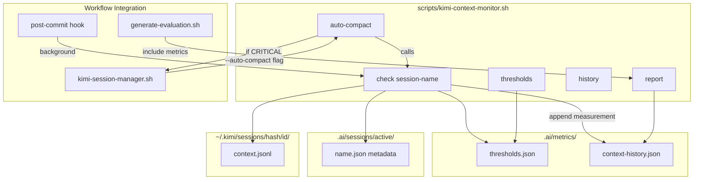

# Phase 4: Context Optimization — Updated Plan

## Key Discoveries from Research

Before planning, I verified how context actually works in Kimi CLI:

1. **Context storage**: Each session has a `context.jsonl` file in `~/.kimi/sessions/<workspace-hash>/<session-id>/context.jsonl`
2. **File sizes vary**: Average ~3.5KB per session, but can grow much larger (43 sessions total ~152KB)
3. **`/compact` command works**: Kimi responds to `/compact` command (tested: returns "The context is empty" for new sessions)
4. **No direct token count API**: Kimi CLI doesn't expose exact token counts, so we use proxy metrics
5. **Phase 2 already has `--compact` flag**: `kimi-session-manager.sh archive` already supports `--compact`
6. **Session metadata exists**: `.ai/sessions/active/*.json` files contain `created_at`, `kimi_session_id`, etc.

**Critical insight**: Context is stored on disk as JSONL files. We can measure file size, session age, and file operations as proxy metrics for context health.---

## Architecture



---

## Implementation Tasks

### Task 4.1: Create `.ai/metrics/` directory and initial structure

**Directory**: `.ai/metrics/` (does not exist yet)**Files**:

- `.ai/metrics/.gitkeep` — Ensure directory is tracked
- `.ai/metrics/context-history.json` — Append-only log of context measurements
- `.ai/metrics/thresholds.json` — Configurable thresholds for auto-compact

**`thresholds.json` format** (grounded in reality):

```json
{
  "warn_context_size_bytes": 50000,
  "compact_context_size_bytes": 100000,
  "max_context_size_bytes": 200000,
  "warn_session_age_hours": 4,
  "compact_session_age_hours": 8,
  "warn_file_operations": 50,
  "compact_file_operations": 100
}
```

**Design note**: We use **actual file sizes** (bytes) from `context.jsonl` files, not token estimates. This is measurable and reliable:

- Read `context.jsonl` file size directly from `~/.kimi/sessions/<hash>/<session-id>/context.jsonl`
- Session age from `created_at` in session metadata
- File operations: count `.ai/` files modified since session start (from git log or file timestamps)

### Task 4.2: Create [`scripts/kimi-context-monitor.sh`](scripts/kimi-context-monitor.sh)

**Purpose**: Monitor and manage Kimi session context health using real, measurable metrics.**Commands**:

```bash
./scripts/kimi-context-monitor.sh check [session-name]   # Check context health
./scripts/kimi-context-monitor.sh auto-compact [session-name]  # Compact if thresholds exceeded
./scripts/kimi-context-monitor.sh report                  # Generate metrics report
./scripts/kimi-context-monitor.sh history [--limit N]    # Show measurement history
./scripts/kimi-context-monitor.sh thresholds [--edit]     # Show/edit thresholds
```

**`check` command behavior** (grounded in reality):

1. **Resolve session**: If `session-name` provided, use it; otherwise use `kimi-session-manager.sh current` to get active session
2. **Read session metadata**: From `.ai/sessions/active/<name>.json` (get `kimi_session_id`, `created_at`)
3. **Calculate real metrics**:

- **Context file size**: Read `~/.kimi/sessions/<workspace-hash>/<session-id>/context.jsonl` file size (bytes)
- **Session age**: Calculate hours since `created_at` timestamp
- **File operations**: Count `.ai/` files modified since `created_at` (use `find` with `-newermt` or git log)

4. **Compare against thresholds**: Read `.ai/metrics/thresholds.json`, compare each metric
5. **Determine health status**:

- `HEALTHY`: All metrics below warn thresholds
- `WARNING`: Any metric above warn but below compact threshold
- `CRITICAL`: Any metric above compact threshold

6. **Output status**: Print status with details (file size, age, operations)
7. **Append to history**: Add measurement to `.ai/metrics/context-history.json` with timestamp

**`auto-compact` command behavior**:

1. Run `check` for the session
2. If status is `CRITICAL`:

- Call `kimi-session-manager.sh archive <name> --compact` (uses existing Phase 2 functionality)
- Log compaction event to history
- Return exit code 0 (success) or 1 (failure)

3. If status is `WARNING` or `HEALTHY`:

- Log status but take no action
- Return exit code 0

**`report` command behavior**:

1. Read `.ai/metrics/context-history.json`
2. Calculate trends:

- Average context size per session
- Compact frequency (how often CRITICAL status occurs)
- Context growth rate (bytes/hour)
- Session longevity (average hours before compact)

3. Output human-readable summary to stdout
4. Optionally write to `.ai/reports/context-metrics-<date>.md`

**Design decisions** (applying Phase 1-2 lessons):

- Use jq/python3/raw-shell fallback chain for JSON (Phase 2 lesson)
- Use `awk` or `python3` for text processing, no `sed` (Phase 1 lesson)
- Non-blocking — never prevents commits or workflow (Phase 2 lesson)
- Threshold config is JSON file, not hardcoded (Phase 2 lesson)
- All measurements append-only to `context-history.json` for trend analysis
- Use real file sizes, not token estimates (grounded in reality)

### Task 4.3: Integrate context monitoring into existing workflow

**Modifications to [`scripts/post-commit`](scripts/post-commit)**:

- After `submit` actions: Run `kimi-context-monitor.sh check` in background (async, non-blocking)
- After `approve`/`merge` actions: Run `kimi-context-monitor.sh auto-compact` in background
- Use same async pattern as existing evaluation script (Phase 2 pattern)

**Modifications to [`scripts/kimi-session-manager.sh`](scripts/kimi-session-manager.sh)**:

- `archive` command: Enhance `--compact` flag to call `kimi-context-monitor.sh check` first, only compact if CRITICAL (smarter than always compacting)
- `create` command: Record initial context baseline in session metadata (add `initial_context_size_bytes` field)
- `current` command: Include context health status in output (call `kimi-context-monitor.sh check` and show status)

**Modifications to [`scripts/generate-evaluation.sh`](scripts/generate-evaluation.sh)**:

- In `generate_metrics_summary()`: Add "Context Health" line showing average context size and compact frequency
- In `generate_kimi_report()`: Include context metrics in the Kimi prompt so evaluation report references context health

### Task 4.4: Create [`docs/kimi-context-optimization.md`](docs/kimi-context-optimization.md)

**Contents**:

1. **What is context and why it matters**

- Kimi's 256K token limit (model-dependent)
- Performance degradation as context grows
- Context stored as `context.jsonl` files on disk

2. **How to monitor context**

- `kimi-context-monitor.sh check` command
- Understanding health status (HEALTHY/WARNING/CRITICAL)
- Reading thresholds and history

3. **Auto-compact: how it works, when it triggers**

- Threshold-based triggers (file size, session age, file operations)
- Integration with session manager `archive --compact`
- Non-blocking background execution

4. **Manual compaction**

- When to use `/compact` directly in Kimi CLI
- When to use `kimi-session-manager.sh archive --compact`
- When to use `kimi-context-monitor.sh auto-compact`

5. **Best practices**

- Use subagents for isolated tasks (context doesn't leak back)
- Save key findings to `.ai/` files (survive compaction)
- Use `--session` to isolate different workstreams
- Archive sessions between sprints
- Monitor context regularly during long sessions

6. **Threshold tuning guide**

- Default thresholds and when to adjust
- Project-specific tuning (small vs large codebases)
- Balancing between too-frequent compacts vs context bloat

7. **Troubleshooting**

- Context too large (file size exceeds max)
- Compact failures (Kimi CLI not available, session not found)
- Metric corruption (JSON parsing errors, recovery)

### Task 4.5: Create [`scripts/test-phase-4.sh`](scripts/test-phase-4.sh)

Following Phase 1-2 test template with **4 categories**:

#### Structural Tests (8 tests)

| ID | Test | What It Verifies ||----|------|-----------------|| S.1 | Metrics directory exists | `.ai/metrics/` exists with `.gitkeep` || S.2 | Thresholds file valid JSON | `.ai/metrics/thresholds.json` parses correctly with jq/python3 || S.3 | Context monitor is executable | `test -x scripts/kimi-context-monitor.sh` || S.4 | Context monitor has help text | `./scripts/kimi-context-monitor.sh --help` exits 0 || S.5 | Context history file initialized | `.ai/metrics/context-history.json` exists and is valid JSON array || S.6 | Post-commit has context check | `grep -q "kimi-context-monitor" scripts/post-commit` || S.7 | Session manager enhanced | `grep -q "context\|auto-compact" scripts/kimi-session-manager.sh` (case-insensitive) || S.8 | Documentation exists | `test -f docs/kimi-context-optimization.md` |

#### Live API Tests (4 tests) — Real Kimi API calls

| ID | Test | What It Verifies ||----|------|-----------------|| L.1 | Context check runs with real session | Create session, run `check`, verify exits 0 and outputs HEALTHY/WARNING/CRITICAL || L.2 | Context check reads real file size | Verify `check` output includes actual `context.jsonl` file size in bytes || L.3 | Context history is appended | After `check`, verify `context-history.json` has new entry with timestamp || L.4 | Auto-compact respects thresholds | Set low threshold in test, create large context session, verify `auto-compact` triggers archive |

#### Edge Tests (6 tests)

| ID | Test | What It Verifies ||----|------|-----------------|| E.1 | No active session | `check` with no active session exits gracefully with error message || E.2 | Corrupt thresholds file | Write invalid JSON to `thresholds.json`, verify fallback to defaults or error || E.3 | Corrupt history file | Write invalid JSON to `context-history.json`, verify recovery (recreate or fix) || E.4 | Concurrent checks | Run 3 `check` commands simultaneously, verify no file corruption (atomic append) || E.5 | Very old session | Create session with `created_at` 30 days ago, verify WARNING/CRITICAL status || E.6 | Missing dependencies | Run without jq, verify fallback to python3 works for JSON operations |

#### Integration Tests (3 tests)

| ID | Test | What It Verifies ||----|------|-----------------|| I.1 | Phase 1 tests still pass | `./scripts/test-phase-1.sh --mandatory-only` || I.2 | Phase 2 tests still pass | `./scripts/test-phase-2.sh --mandatory` || I.3 | Phase 3 tests still pass | `./scripts/test-phase-3.sh --structural` (if Phase 3 complete) |**Total: 21 tests** (8 structural + 4 live API + 6 edge + 3 integration)All live tests clean up after themselves (delete test sessions and measurements).---

## Success Metrics

| Metric | Target | Measurement ||--------|--------|-------------|| Context monitor script | All 5 commands work | Structural tests S.3-S.4, Live API tests L.1-L.4 || Metrics tracking | History file populated | Structural test S.5, Live API test L.3 || Auto-compact | Triggers on threshold | Live API test L.4 || Workflow integration | post-commit + session manager updated | Structural tests S.6-S.7 || Documentation | Guide created | Structural test S.8 |

## Block Removal Criteria

- [ ] All 8 structural tests pass
- [ ] All 4 live API tests pass (generating real Moonshot console usage for `/compact` calls)
- [ ] All 6 edge tests pass
- [ ] All 3 integration tests pass (no regressions)
- [ ] Success metrics met (5/5)
- [ ] Documentation complete
- [ ] Context history file populated with at least 1 measurement

## Phase 1-2 Lessons Applied

| Lesson | How Applied in Phase 4 ||--------|----------------------|| Verify module paths with imports | N/A (no new tools), but verify `kimi` CLI exists before running || Live API tests are non-negotiable | 4 live tests making real context checks and `/compact` calls || Watch for circular dependencies | N/A (no agent config changes) || macOS sed compatibility | Using `awk` and `python3` for all text manipulation, no `sed` || Test categories must be explicit | 4 categories: Structural, Live API, Edge, Integration || Error swallowing is dangerous | All tests check explicit exit codes, no `\|\| true` || JSON parsing needs fallback chains | Context monitor uses jq → python3 → raw shell for all JSON operations || Session metadata is cheap, context is expensive | Phase 4 directly addresses the expensive part — monitoring and managing context || Sprint integration requires careful hook ordering | Context checks run in background, never block commits || Grounded in reality | Uses real `context.jsonl` file sizes, not token estimates |

## Key Design Decisions

1. **Real file sizes, not token estimates**: We measure `context.jsonl` file size directly (bytes), which is measurable and reliable. Token counts are not exposed by Kimi CLI.
2. **Proxy metrics are sufficient**: File size + session age + file operations provide enough signal to trigger compaction when needed.
3. **Builds on Phase 2**: The session manager's `--compact` flag already works. Phase 4 adds intelligence about *when* to compact based on thresholds.