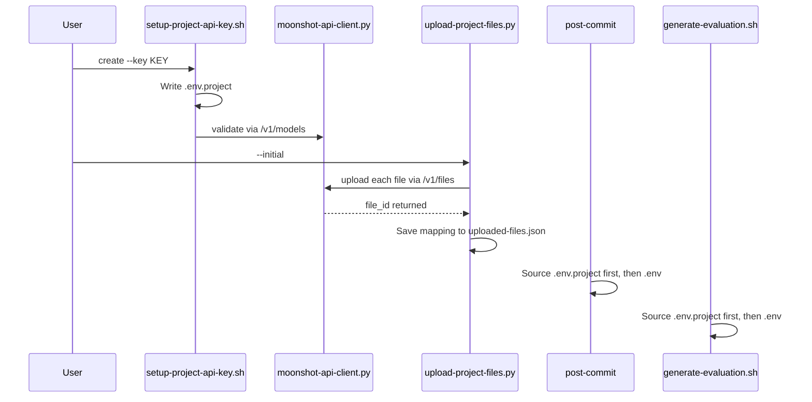

# Phase 5: Moonshot API Integration — Final Implementation Plan

## Key Findings from Research

1. **No previous phase uses the Moonshot REST API directly** — all Kimi interactions go through CLI (`kimi --print`). Phase 5 is the first to call `https://api.moonshot.cn/v1` endpoints.
2. **Neither `openai` nor `requests` are installed** — and the project has no `requirements.txt`.
3. **Existing `wire-daemon.py` uses only Python stdlib** — setting the precedent.
4. **`.env.project` is not in `.gitignore`** — `.env` and `.env.local` are, but not `.env.project`.
5. **6 scripts currently load `.env`** — `post-commit`, `generate-evaluation.sh`, `test-wire-daemon.sh`, `test-git-hooks.sh` need `.env.project` added before `.env`.

**Decision: Use Python stdlib only** (`urllib.request`, `json`, `pathlib`) for the API client. The Moonshot API is OpenAI-compatible REST — standard HTTP multipart/JSON calls work without any packages. This matches the `wire-daemon.py` precedent and avoids introducing `pip install` as a prerequisite.---

## Architecture



---

## Files to Create (7)

| File | Purpose ||------|---------|| [`scripts/setup-project-api-key.sh`](scripts/setup-project-api-key.sh) | Manage `.env.project` (create, validate, remove, status) || [`scripts/moonshot-api-client.py`](scripts/moonshot-api-client.py) | Python stdlib Files API client (upload, list, get, delete, content) || [`scripts/upload-project-files.py`](scripts/upload-project-files.py) | Batch upload/sync project files to Moonshot || [`.ai/metrics/uploaded-files.json`](.ai/metrics/uploaded-files.json) | Tracks file path to Moonshot file ID mapping || [`docs/moonshot-api-integration.md`](docs/moonshot-api-integration.md) | User-facing documentation (7 sections) || [`scripts/test-phase-5.sh`](scripts/test-phase-5.sh) | 25-test suite || [`.ai/reports/phase-5-completion.md`](.ai/reports/phase-5-completion.md) | Completion report |

## Files to Modify (6)

| File | Change ||------|--------|| [`.gitignore`](.gitignore) | Add `.env.project` || [`scripts/post-commit`](scripts/post-commit) | Add `.env.project` loading before `.env` || [`scripts/generate-evaluation.sh`](scripts/generate-evaluation.sh) | Add `.env.project` loading before `.env`, add `--stream` flag || [`scripts/kimi-session-manager.sh`](scripts/kimi-session-manager.sh) | Add `.env.project` loading || [`scripts/kimi-context-monitor.sh`](scripts/kimi-context-monitor.sh) | Add `.env.project` loading || [`.ai/status.md`](.ai/status.md) | Mark Phase 5 DONE |---

## Implementation Tasks

### Task 5.1: `scripts/setup-project-api-key.sh`

4 commands: `create`, `validate`, `remove`, `status`. Key validation calls `https://api.moonshot.cn/v1/models` using `curl` (available on all systems). Creates `.env.project` with `KIMI_API_KEY=...`. Non-interactive with `--key` flag for automation. Adds `.env.project` to `.gitignore` if missing.

### Task 5.2: `scripts/moonshot-api-client.py`

**Uses Python stdlib only** — `urllib.request` for HTTP, `json` for parsing, `pathlib` for file paths. Base URL: `https://api.moonshot.cn/v1`. Reads API key with priority: `.env.project` > `.env` > `KIMI_API_KEY` env var.5 operations: `upload` (multipart POST `/v1/files`), `list` (GET `/v1/files`), `get` (GET `/v1/files/{id}`), `delete` (DELETE `/v1/files/{id}`), `content` (GET `/v1/files/{id}/content`). CLI interface with `argparse`. Returns JSON to stdout for scripting.

### Task 5.3: `scripts/upload-project-files.py`

4 modes: `--initial` (upload all), `--sync` (only changed), `--list` (show uploaded), `--clean` (delete all). Uploads `.agents/`, `.ai/`, `README.md`, `AGENTS.md`, `CLAUDE.md`. Excludes `.env*`, `*.log`, `.git/`. Tracks mappings in `.ai/metrics/uploaded-files.json`. Uses `moonshot-api-client.py` functions as library import.

### Task 5.4: `.env.project` integration across all scripts

Apply this pattern to all 4 shell scripts that currently load `.env`:

```bash
# Load .env.project first (project-specific, highest priority)
REPO_ROOT="$(git rev-parse --show-toplevel 2>/dev/null || echo ".")"
if [ -f "$REPO_ROOT/.env.project" ]; then
    set -a; source "$REPO_ROOT/.env.project"; set +a
fi
# Then .env (global fallback)
if [ -f "$REPO_ROOT/.env" ]; then
    set -a; source "$REPO_ROOT/.env"; set +a
fi
```

Also add `--stream` flag to `generate-evaluation.sh` that uses `kimi --print --output-format stream-json` for streaming evaluation reports.

### Task 5.5: Documentation

`docs/moonshot-api-integration.md` with 7 sections: Overview, Project API Keys, Files API, Cached Tokens, Streaming, Best Practices, Troubleshooting.

### Task 5.6: Test suite — 25 tests

| Category | Count | Key tests ||----------|-------|-----------|| Structural | 10 | Scripts exist/executable, help text, `.env.project` in gitignore, all scripts check `.env.project`, upload tracking valid JSON, docs exist || Live API | 6 | Key validation, file upload, list, get, delete, streaming || Edge | 6 | Invalid key, missing key, large file, duplicate upload, corrupt tracking file, network errors || Integration | 3 | Phase 1-4 tests still pass |

### Task 5.7: Gate

Update `.ai/status.md`, create `.ai/reports/phase-5-completion.md`, verify block removal criteria.---

## Key Design Decision: stdlib over openai package

| Factor | stdlib (`urllib.request`) | `openai` package ||--------|--------------------------|------------------|| Dependencies | Zero new | `pip install openai` required || Precedent | Matches `wire-daemon.py` | Breaks zero-dependency pattern || Complexity | Slightly more HTTP code | Cleaner API calls || Portability | Works anywhere Python 3 exists | Requires pip/venv setup || Maintenance | Standard library, never breaks | Package version updates |The Moonshot API endpoints are standard REST (POST with JSON body, multipart for uploads). `urllib.request` handles this in ~20 lines per operation.---