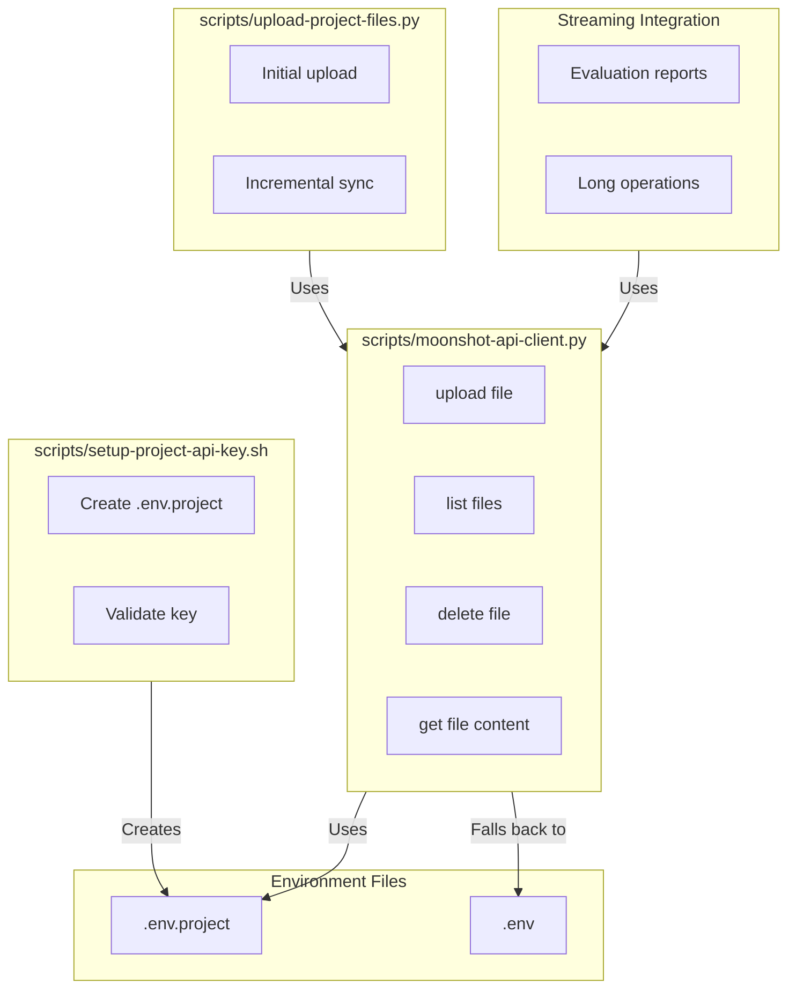

# Pha

se 5: Moonshot API Integration — Updated Plan

## Key Discoveries from Research

Before planning, I verified Moonshot API capabilities from TASK-002-research.md:

1. **Files API exists**: "Upload, reference in conversations, Q&A" (line 448)
2. **Cached tokens**: $0.15/1M (75% savings vs $0.60/1M input tokens) — line 445
3. **Streaming**: SSE-based, ~60-100 tokens/s — line 443
4. **API compatibility**: OpenAI-compatible (same SDK, change base URL) — line 442
5. **Current state**: `.env` file exists with `KIMI_API_KEY`, no `.env.project` yet
6. **Python dependencies**: `requests` and `openai` not installed — need to add

**Critical insight**: Moonshot API is OpenAI-compatible, so we can use the `openai` Python SDK with a different base URL. Files API allows uploading project files for persistent context across sessions.---

## Architecture



---

## Implementation Tasks

### Task 5.1: Create project-specific API key management

**File**: [`scripts/setup-project-api-key.sh`](scripts/setup-project-api-key.sh)**Purpose**: Manage project-specific API keys separate from global `.env`**Commands**:

```bash
./scripts/setup-project-api-key.sh create [--key KEY]    # Create .env.project with API key
./scripts/setup-project-api-key.sh validate              # Test API key works
./scripts/setup-project-api-key.sh remove                # Delete .env.project
./scripts/setup-project-api-key.sh status                # Show current key source
```

**Behavior**:

1. **`create`**: 

- Prompts for API key if `--key` not provided
- Creates `.env.project` with `KIMI_API_KEY=...`
- Validates key by making test API call
- Updates `.gitignore` to include `.env.project` if not already there

2. **`validate`**: Tests API key by calling Moonshot API `/v1/models` endpoint
3. **`remove`**: Deletes `.env.project` file
4. **`status`**: Shows which key source is active (`.env.project` takes priority)

**Priority order** (applied to all scripts):

1. `.env.project` (project-specific, highest priority)
2. `.env` (global, fallback)
3. `KIMI_API_KEY` environment variable (lowest priority)

**Design decisions** (applying Phase 1-2 lessons):

- Use `jq`/`python3`/raw-shell fallback for JSON parsing (Phase 2 lesson)
- Use `awk` or `python3` for text processing, no `sed` (Phase 1 lesson)
- Validate API key with real API call, not just format check (Phase 1 lesson: live tests)

### Task 5.2: Create Moonshot Files API client

**File**: [`scripts/moonshot-api-client.py`](scripts/moonshot-api-client.py)**Purpose**: Python client for Moonshot Files API operations**Dependencies**:

- `openai` Python package (OpenAI-compatible SDK)
- `requests` for direct HTTP if needed

**Functions**:

```python
def upload_file(file_path: str, purpose: str = "assistants") -> dict
def list_files(purpose: str = None) -> list[dict]
def get_file(file_id: str) -> dict
def delete_file(file_id: str) -> bool
def get_file_content(file_id: str) -> str
```

**API Configuration**:

- Base URL: `https://api.moonshot.cn/v1` (Moonshot API endpoint)
- Uses OpenAI SDK with custom base URL
- Reads API key from `.env.project` → `.env` → `KIMI_API_KEY` env var

**CLI interface**:

```bash
python3 scripts/moonshot-api-client.py upload <file> [--purpose assistants]
python3 scripts/moonshot-api-client.py list [--purpose assistants]
python3 scripts/moonshot-api-client.py get <file-id>
python3 scripts/moonshot-api-client.py delete <file-id>
python3 scripts/moonshot-api-client.py content <file-id>
```

**Design decisions**:

- Use OpenAI SDK for compatibility (verified: Moonshot is OpenAI-compatible)
- Handle API key priority (`.env.project` → `.env` → env var)
- Return structured JSON for programmatic use
- Include error handling with clear messages

### Task 5.3: Create file upload script

**File**: [`scripts/upload-project-files.py`](scripts/upload-project-files.py)**Purpose**: Upload project files to Moonshot for persistent context**Usage**:

```bash
./scripts/upload-project-files.py --initial    # Upload all project files
./scripts/upload-project-files.py --sync      # Incremental sync (only changed files)
./scripts/upload-project-files.py --list       # List uploaded files
./scripts/upload-project-files.py --clean     # Delete all uploaded files
```

**File selection** (what to upload):

- `.agents/` directory (agent configs, prompts, skills)
- `.ai/` directory (tasks, instructions, reports, status)
- Key project files: `README.md`, `AGENTS.md`, `CLAUDE.md`
- Exclude: `node_modules/`, `.git/`, `.env*`, `*.log`, large binary files

**Sync mechanism**:

- Track uploaded files in `.ai/metrics/uploaded-files.json` (file path → Moonshot file ID mapping)
- Compare file modification times to detect changes
- Only upload changed files on `--sync`

**Design decisions**:

- Track uploads in JSON file for incremental sync (Phase 2 lesson: JSON with fallback)
- Exclude large/binary files to stay within API limits
- Use file modification times for change detection (simple, reliable)

### Task 5.4: Integrate cached tokens optimization

**Context**: Cached tokens cost $0.15/1M vs $0.60/1M input (75% savings)**Strategy**: Reuse sessions for similar operations to maximize cache hits**Implementation**:

1. **Track token usage**: Add token tracking to `kimi-context-monitor.sh` (Phase 4 integration)

- Read token usage from Kimi API responses (if available)
- Store in `.ai/metrics/token-usage.json`

2. **Session reuse**: Enhance `kimi-session-manager.sh` to recommend session reuse

- `current` command: Show token usage and cache hit rate if available

3. **Documentation**: Add best practices for maximizing cached tokens

- Use same session for related tasks
- Group similar operations together
- Avoid frequent session switching

**Note**: Kimi CLI may not expose exact token counts in all modes. We track what's available and document best practices.

### Task 5.5: Enable streaming for long operations

**Context**: Streaming is SSE-based, ~60-100 tokens/s (line 443)**Implementation**:

1. **Update `generate-evaluation.sh`**: Add `--stream` flag for streaming evaluation reports

- Use `kimi --print --output-format stream-json` for streaming
- Stream output to file as it arrives

2. **Create streaming helper**: `scripts/kimi-stream-helper.sh`

- Wrapper for streaming Kimi operations
- Handles SSE parsing and output formatting

3. **Documentation**: When to use streaming vs non-streaming

- Use streaming for: Long evaluation reports, large file processing, real-time feedback
- Use non-streaming for: Quick operations, structured output needed immediately

**Design decisions**:

- Build on existing `--print` mode (Phase 2 pattern)
- Make streaming optional (backward compatible)
- Handle SSE parsing correctly (verify format)

### Task 5.6: Update all scripts to check `.env.project` first

**Files to modify**:

- `scripts/post-commit` — Already checks `.env`, add `.env.project` check first
- `scripts/generate-evaluation.sh` — Add `.env.project` check
- `scripts/kimi-session-manager.sh` — Add `.env.project` check
- `scripts/kimi-context-monitor.sh` — Add `.env.project` check (if Phase 4 complete)
- `scripts/wire-daemon.py` — Add `.env.project` check

**Pattern** (apply consistently):

```bash
# Load .env.project first (project-specific, highest priority)
if [ -f "$(git rev-parse --show-toplevel)/.env.project" ]; then
    set -a
    source "$(git rev-parse --show-toplevel)/.env.project"
    set +a
fi

# Then load .env (global, fallback)
if [ -f "$(git rev-parse --show-toplevel)/.env" ]; then
    set -a
    source "$(git rev-parse --show-toplevel)/.env"
    set +a
fi
```


### Task 5.7: Create [`docs/moonshot-api-integration.md`](docs/moonshot-api-integration.md)

**Contents**:

1. **Overview**: What Moonshot API integration provides
2. **Project API keys**: Why `.env.project` exists, how to set it up
3. **Files API**: Uploading files for persistent context, use cases
4. **Cached tokens**: How to maximize savings (75% reduction)
5. **Streaming**: When and how to use streaming for long operations
6. **Best practices**: File selection, sync frequency, token optimization
7. **Troubleshooting**: API key issues, upload failures, streaming errors

### Task 5.8: Create [`scripts/test-phase-5.sh`](scripts/test-phase-5.sh)

Following Phase 1-3 test template with **4 categories**:

#### Structural Tests (10 tests)

| ID | Test | What It Verifies ||----|------|-----------------|| S.1 | API key setup script exists | `test -x scripts/setup-project-api-key.sh` || S.2 | API key setup has help text | `./scripts/setup-project-api-key.sh --help` exits 0 || S.3 | Moonshot API client exists | `test -f scripts/moonshot-api-client.py` || S.4 | Moonshot API client is executable | `test -x scripts/moonshot-api-client.py` or `python3 scripts/moonshot-api-client.py --help` || S.5 | File upload script exists | `test -f scripts/upload-project-files.py` || S.6 | File upload script is executable | `test -x scripts/upload-project-files.py` or `python3 scripts/upload-project-files.py --help` || S.7 | Python dependencies available | `python3 -c "import openai, requests"` exits 0 || S.8 | All scripts check .env.project | `grep -q "\.env\.project" scripts/post-commit scripts/generate-evaluation.sh` || S.9 | Upload tracking file structure | `.ai/metrics/uploaded-files.json` exists and is valid JSON || S.10 | Documentation exists | `test -f docs/moonshot-api-integration.md` |

#### Live API Tests (6 tests) — Real Moonshot API calls

| ID | Test | What It Verifies ||----|------|-----------------|| L.1 | API key validation works | `setup-project-api-key.sh validate` with real key succeeds || L.2 | Files API upload works | Upload a test file, verify file ID returned || L.3 | Files API list works | List uploaded files, verify test file appears || L.4 | Files API get works | Get file metadata by ID, verify content matches || L.5 | Files API delete works | Delete uploaded file, verify it's removed from list || L.6 | Streaming works | Generate streaming evaluation report, verify output arrives incrementally |

#### Edge Tests (6 tests)

| ID | Test | What It Verifies ||----|------|-----------------|| E.1 | Invalid API key rejected | Test with bad key, verify graceful error || E.2 | Missing API key handled | Test without key, verify clear error message || E.3 | Large file upload | Upload file near API limit, verify handling || E.4 | Duplicate file upload | Upload same file twice, verify idempotent behavior || E.5 | Corrupt upload tracking file | Corrupt `uploaded-files.json`, verify recovery || E.6 | Network failure handling | Simulate network error, verify retry or graceful failure |

#### Integration Tests (3 tests)

| ID | Test | What It Verifies ||----|------|-----------------|| I.1 | Phase 1 tests still pass | `./scripts/test-phase-1.sh --mandatory-only` || I.2 | Phase 2 tests still pass | `./scripts/test-phase-2.sh --mandatory` || I.3 | Phase 3-4 tests still pass | `./scripts/test-phase-3.sh --structural` (if complete), `./scripts/test-phase-4.sh --structural` (if complete) |**Total: 25 tests** (10 structural + 6 live API + 6 edge + 3 integration)All live tests clean up after themselves (delete test files from Moonshot).---

## Success Metrics

| Metric | Target | Measurement ||--------|--------|-------------|| Project API key management | Script works, priority order correct | Structural tests S.1-S.2, Live API test L.1 || Files API client | All 5 operations work | Structural tests S.3-S.4, Live API tests L.2-L.5 || File upload script | Initial and sync work | Structural tests S.5-S.6, Live API test L.2 || Cached tokens optimization | Best practices documented | Documentation test S.10 || Streaming integration | Streaming works for long ops | Live API test L.6 || Script integration | All scripts check .env.project | Structural test S.8 |

## Block Removal Criteria

- [ ] All 10 structural tests pass
- [ ] All 6 live API tests pass (generating real Moonshot API usage)
- [ ] All 6 edge tests pass
- [ ] All 3 integration tests pass (no regressions)
- [ ] Success metrics met (6/6)
- [ ] Documentation complete
- [ ] At least 1 file successfully uploaded to Moonshot

## Phase 1-3 Lessons Applied

| Lesson | How Applied in Phase 5 ||--------|----------------------|| Verify module paths with imports | Verify `openai` and `requests` packages exist before use || Live API tests are non-negotiable | 6 live tests making real Moonshot API calls || Watch for circular dependencies | N/A (no agent config changes) || macOS sed compatibility | Using `awk` and `python3` for all text manipulation, no `sed` || Test categories must be explicit | 4 categories: Structural, Live API, Edge, Integration || Error swallowing is dangerous | All tests check explicit exit codes, no `\|\| true` || JSON parsing needs fallback chains | Upload tracking uses jq → python3 → raw shell for JSON operations || Grounded in reality | Verified Moonshot API capabilities from research doc, not assumptions || API key priority | `.env.project` → `.env` → env var (consistent across all scripts) |

## Key Design Decisions

1. **OpenAI SDK compatibility**: Moonshot API is OpenAI-compatible, so we use the `openai` Python SDK with custom base URL. This is verified from research (line 442).