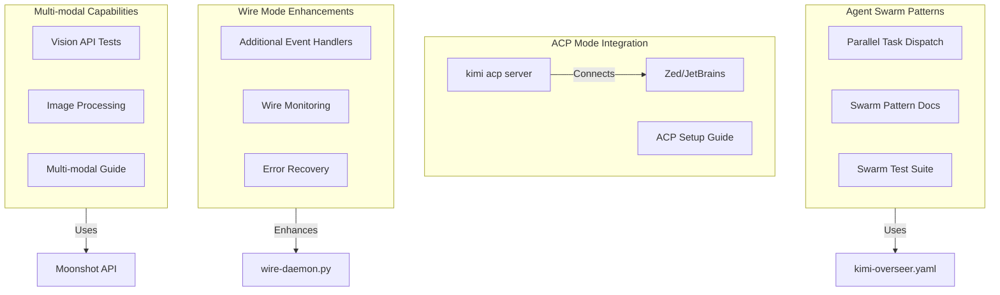

# Phase 6: Advanced Features — Updated Plan

## Key Discoveries from Research

Before planning, I verified advanced Kimi capabilities from research and current system state:

1. **Agent Swarm (K2.5)**: Up to 100 sub-agents, 1,500 tool calls per session (TASK-002-research.md line 457)
2. **Current model**: Already using `moonshot-ai/kimi-k2.5` (verified from `~/.kimi/config.toml`)
3. **ACP mode exists**: `kimi acp` command available (verified from `kimi --help`)
4. **Wire Mode already implemented**: `wire-daemon.py` exists with basic event handlers (TurnBegin, TurnEnd, ToolCall, ToolResult, ApprovalRequest)
5. **Multi-modal (K2.5)**: Native vision + text capabilities (research line 456), but no explicit CLI flags found
6. **Parallel subagents**: Kimi confirmed it can dispatch multiple `Task` calls in parallel in a single response

**Critical insight**: Agent Swarm is not a separate mode — it's the capability to create many parallel subagents. K2.5 model already supports this. We need to test and document patterns, not enable a feature.---

## Architecture

---

## Implementation Tasks

### Task 6.1: Test and document Agent Swarm patterns

**Context**: Agent Swarm is not a feature to enable — it's the capability of K2.5 to handle many parallel subagents. We already use K2.5, so we need to test and document patterns.**Implementation**:

1. **Create [`docs/kimi-agent-swarm.md`](docs/kimi-agent-swarm.md)**:

- What Agent Swarm is (many parallel subagents, not a separate mode)
- When to use parallel subagents vs sequential
- K2.5 limits: 100 sub-agents, 1,500 tool calls per session
- Best practices: task decomposition, independence, result aggregation

2. **Create [`.ai/patterns/agent-swarm-parallel-review.md`](.ai/patterns/agent-swarm-parallel-review.md)**:

- Pattern: Review multiple tasks in parallel
- Example: Dispatch 5 reviewer subagents simultaneously
- Use case: Sprint end review of all completed tasks

3. **Create [`.ai/patterns/agent-swarm-research-split.md`](.ai/patterns/agent-swarm-research-split.md)**:

- Pattern: Split research task across multiple researcher subagents
- Example: Research 10 different APIs in parallel
- Use case: Large research tasks that can be decomposed

4. **Update [`.agents/prompts/overseer.md`](.agents/prompts/overseer.md)**:

- Add "Agent Swarm Patterns" section
- Document when to use parallel vs sequential subagents
- Reference pattern files in `.ai/patterns/`

**Design decisions**:

- Document patterns, not implement new features (Agent Swarm is already available)
- Test with real parallel subagent dispatch (Phase 1 lesson: live API tests)
- Focus on practical use cases (sprint reviews, research splits)

### Task 6.2: Explore and document ACP mode

**Context**: ACP mode is for IDE integration (Zed, JetBrains). We need to test it and document setup.**Implementation**:

1. **Test ACP mode connection**:

- Run `kimi acp` and verify it starts a server
- Test connection (if possible without IDE)
- Document port, protocol, authentication

2. **Create [`docs/kimi-acp-integration.md`](docs/kimi-acp-integration.md)**:

- What ACP mode is (IDE integration protocol)
- How to start ACP server (`kimi acp`)
- Setup for Zed IDE
- Setup for JetBrains IDEs
- Troubleshooting: connection failures, port conflicts

3. **Create helper script** [`scripts/start-acp-server.sh`](scripts/start-acp-server.sh):

- Wrapper to start ACP server with proper configuration
- Check prerequisites (Kimi CLI, API key)
- Background/foreground options
- Status checking

**Design decisions**:

- Document what's possible (may not be able to fully test without IDE)
- Provide setup instructions for common IDEs
- Make ACP server management easy (helper script)

### Task 6.3: Enhance Wire Mode daemon

**Context**: Wire daemon already exists with basic event handlers. We can enhance it with more handlers, monitoring, and error recovery.**Current event handlers** (from `wire-daemon.py`):

- `TurnBegin` — logs "Turn started"
- `TurnEnd` — logs "Turn ended"
- `ToolCall` — logs tool name
- `ToolResult` — logs errors
- `ApprovalRequest` — handled by ApprovalHandler

**Enhancements**:

1. **Add monitoring event handlers**:

- Track tool call counts per session
- Track token usage (if available in events)
- Track session duration
- Store metrics in `.ai/metrics/wire-metrics.json`

2. **Improve error recovery**:

- Detect Wire Mode disconnections
- Auto-reconnect on failure
- Retry failed requests with exponential backoff
- Log recovery actions

3. **Add more event handlers** (if available):

- `StepBegin` / `StepEnd` — track multi-step operations
- `ContentPart` — track streaming content
- `StatusUpdate` — track context/token usage

4. **Create [`docs/kimi-wire-enhancements.md`](docs/kimi-wire-enhancements.md)**:

- New event handlers available
- Monitoring capabilities
- Error recovery features
- Best practices for Wire Mode

**Files to modify**:

- [`scripts/wire-daemon.py`](scripts/wire-daemon.py) — Add new event handlers, monitoring, error recovery

**Design decisions**:

- Build on existing Wire Mode implementation (don't rewrite)
- Add monitoring incrementally (start with tool call counts)
- Verify event types exist before implementing handlers (Phase 1 lesson: verify before use)

### Task 6.4: Test and document multi-modal capabilities

**Context**: K2.5 has native vision + text, but no explicit CLI flags found. Need to test if/how it works.**Implementation**:

1. **Research multi-modal API**:

- Check Moonshot API documentation for image input
- Test if Kimi CLI accepts image files
- Verify vision capabilities work

2. **Create test script** [`scripts/test-multimodal.sh`](scripts/test-multimodal.sh):

- Test image upload to Moonshot API
- Test Kimi CLI with image input (if supported)
- Verify vision processing works

3. **Create [`docs/kimi-multimodal.md`](docs/kimi-multimodal.md)**:

- What multi-modal means (vision + text)
- How to use vision capabilities (if available)
- Use cases: UI screenshots, diagram analysis, code visualization
- Limitations and best practices

4. **Create example pattern** [`.ai/patterns/multimodal-ui-review.md`](.ai/patterns/multimodal-ui-review.md):

- Pattern: Review UI screenshots with vision
- Use case: Lovable agent submits UI, reviewer uses vision to verify

**Design decisions**:

- Test capabilities before documenting (grounded in reality)
- Document limitations if vision not available via CLI
- Focus on practical use cases (UI review, diagram analysis)

### Task 6.5: Create [`scripts/test-phase-6.sh`](scripts/test-phase-6.sh)

Following Phase 1-4 test template with **4 categories**:

#### Structural Tests (8 tests)

| ID | Test | What It Verifies ||----|------|-----------------|| S.1 | Agent Swarm docs exist | `test -f docs/kimi-agent-swarm.md` || S.2 | Swarm pattern files exist | `test -f .ai/patterns/agent-swarm-*.md` (2 files) || S.3 | ACP docs exist | `test -f docs/kimi-acp-integration.md` || S.4 | ACP helper script exists | `test -x scripts/start-acp-server.sh` || S.5 | Wire enhancements docs exist | `test -f docs/kimi-wire-enhancements.md` || S.6 | Wire daemon has new handlers | `grep -q "StepBegin\|ContentPart\|StatusUpdate" scripts/wire-daemon.py` (or verify handlers added) || S.7 | Multi-modal docs exist | `test -f docs/kimi-multimodal.md` || S.8 | Overseer prompt mentions swarm | `grep -q "swarm\|parallel.*subagent" .agents/prompts/overseer.md` (case-insensitive) |

#### Live API Tests (6 tests) — Real Kimi API calls

| ID | Test | What It Verifies ||----|------|-----------------|| L.1 | Parallel subagent dispatch works | Create 3 subagents in parallel via `Task`, verify all execute || L.2 | Agent Swarm limit respected | Attempt to create 101 subagents, verify graceful handling or limit enforcement || L.3 | ACP server starts | `kimi acp` starts without error (may not be fully testable without IDE) || L.4 | Wire Mode new events work | Test Wire Mode with new event handlers, verify events received || L.5 | Wire Mode error recovery | Simulate disconnection, verify auto-reconnect works || L.6 | Multi-modal works (if available) | Test image input via API or CLI, verify vision processing |

#### Edge Tests (6 tests)

| ID | Test | What It Verifies ||----|------|-----------------|| E.1 | Too many parallel subagents | Dispatch 50+ subagents, verify system handles gracefully || E.2 | ACP server port conflict | Test starting ACP when port in use, verify error handling || E.3 | Wire Mode connection failure | Test Wire Mode with invalid config, verify graceful error || E.4 | Wire Mode event handler crash | Simulate handler exception, verify daemon doesn't crash || E.5 | Large image processing | Test with very large image, verify handling or error || E.6 | Multi-modal without images | Test multi-modal API with text-only, verify graceful handling |

#### Integration Tests (3 tests)

| ID | Test | What It Verifies ||----|------|-----------------|| I.1 | Phase 1-2 tests still pass | `./scripts/test-phase-1.sh --mandatory-only`, `./scripts/test-phase-2.sh --mandatory` || I.2 | Phase 3-4 tests still pass | `./scripts/test-phase-3.sh --structural` (if complete), `./scripts/test-phase-4.sh --structural` (if complete) || I.3 | Phase 5 tests still pass | `./scripts/test-phase-5.sh --structural` (if complete) |**Total: 23 tests** (8 structural + 6 live API + 6 edge + 3 integration)All live tests clean up after themselves (delete test subagents, stop ACP server if started).---

## Success Metrics

| Metric | Target | Measurement ||--------|--------|-------------|| Agent Swarm patterns | 2 pattern files + docs | Structural tests S.1-S.2 || ACP integration | Docs + helper script | Structural tests S.3-S.4, Live API test L.3 || Wire enhancements | New handlers + docs | Structural tests S.5-S.6, Live API tests L.4-L.5 || Multi-modal | Docs + test script | Structural test S.7, Live API test L.6 || Overseer prompt updated | Swarm section added | Structural test S.8 || No regressions | All previous phases pass | Integration tests I.1-I.3 |

## Block Removal Criteria

- [ ] All 8 structural tests pass
- [ ] All 6 live API tests pass (generating real Moonshot console usage)
- [ ] All 6 edge tests pass
- [ ] All 3 integration tests pass (no regressions)
- [ ] Success metrics met (6/6)
- [ ] Documentation complete
- [ ] At least 1 parallel subagent swarm successfully executed

## Phase 1-4 Lessons Applied

| Lesson | How Applied in Phase 6 ||--------|----------------------|| Verify before use | Test Agent Swarm capabilities, verify ACP mode works, test multi-modal before documenting || Live API tests are non-negotiable | 6 live tests making real parallel subagent calls, ACP server tests, Wire Mode tests || Grounded in reality | Verified K2.5 model already in use, verified ACP command exists, verified Wire Mode already implemented || JSON parsing needs fallback chains | Wire metrics use jq → python3 → raw shell for JSON operations || No `sed` for text processing | Using `awk` and `python3` for all text manipulation || Test categories must be explicit | 4 categories: Structural, Live API, Edge, Integration || Error swallowing is dangerous | All tests check explicit exit codes, no `\|\| true` || Build on existing implementations | Enhance Wire Mode daemon, don't rewrite; document Agent Swarm, don't enable it |

## Key Design Decisions

1. **Agent Swarm is already available**: K2.5 model supports it. We document patterns and test capabilities, not enable a feature.