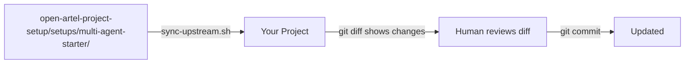

# Upstream Update Workflow for Starter Kit Projects

## Problem

Today the starter kit is a one-time copy. There is no mechanism for projects to pull updates when new features are added (like the chat auto-population we just built). We also need to apply the starter kit to this project itself so we can test it in real development.

## Approach: Git-Based Update Script

The cleanest approach is a **sync script** that lives in every project and can pull the latest starter kit files from the upstream repo. This avoids the complexity of git submodules/subtrees (which create merge headaches) while still giving projects a one-command update path.

### Why not submodules or subtrees?

- **Submodules**: Create nested `.git` repos, confuse agents, require extra git commands on every clone
- **Subtrees**: Merge conflicts when both upstream and project modify the same files (e.g., `AGENTS.md`)
- **Sync script**: Simple, transparent, human-reviewable — just copies files and shows a diff

---

## Part 1: Create the Sync Script

Create [`scripts/sync-upstream.sh`](scripts/sync-upstream.sh) that:

1. Clones (or pulls) the upstream repo to a temp directory
2. Copies **generic files only** (scripts, docs, templates, patterns, skills, subagent templates) — skipping files with `[REPLACE]` placeholders that the project has already customized
3. Shows a `git diff` of what changed
4. Lets the human review and commit

**File categories:**| Category | Action | Examples ||----------|--------|---------|| Generic (always safe to update) | Auto-copy | `scripts/`, `docs/`, `.ai/templates/`, `.ai/patterns/`, `.agents/skills/`, `.agents/subagents/`, `.agents/prompts/`, `.github/workflows/` || Customized per project | Skip (show diff only) | `AGENTS.md`, `CLAUDE.md`, `.cursor/rules/`, `.agents/kimi-overseer.yaml`, `.ai/boundaries.md`, `.ai/status.md` || Project-specific data | Never touch | `.ai/tasks/`, `.ai/reviews/`, `.ai/reports/`, `.ai/chats/`, `.ai/instructions/`, `.ai/ideas/`, `.ai/sessions/`, `.ai/metrics/` |The script will include `--dry-run` (show what would change), `--force` (overwrite everything including customized), and `--diff` (show side-by-side diff of customized files vs upstream).

## Part 2: Apply Starter Kit to This Project

This project (`open-artel-project-setup`) is unique — it IS the upstream repo, so it already has all the scripts, docs, etc. But it is missing the Cursor rules (`.cursor/rules/`) that the starter kit provides. We need to:

1. Copy the 5 `.cursor/rules/*.mdc` files from the starter kit into this project's `.cursor/rules/`
2. Customize them for THIS project (replace `[REPLACE]` placeholders with actual values from `AGENTS.md`)
3. This gives us a live test of the Cursor rules in real development

## Part 3: Add Upstream Tracking to Starter Kit README

Update [`setups/multi-agent-starter/README.md`](setups/multi-agent-starter/README.md) and [`BOOTSTRAP_PLAYBOOK.md`](setups/multi-agent-starter/BOOTSTRAP_PLAYBOOK.md) to document the update workflow:

- How to configure the upstream remote
- How to run the sync script
- What to review after syncing
- How often to check for updates

## Part 4: Copy Sync Script into Starter Kit

Add `scripts/sync-upstream.sh` to `setups/multi-agent-starter/scripts/` so every new project gets the update mechanism from day one.---

## Verification