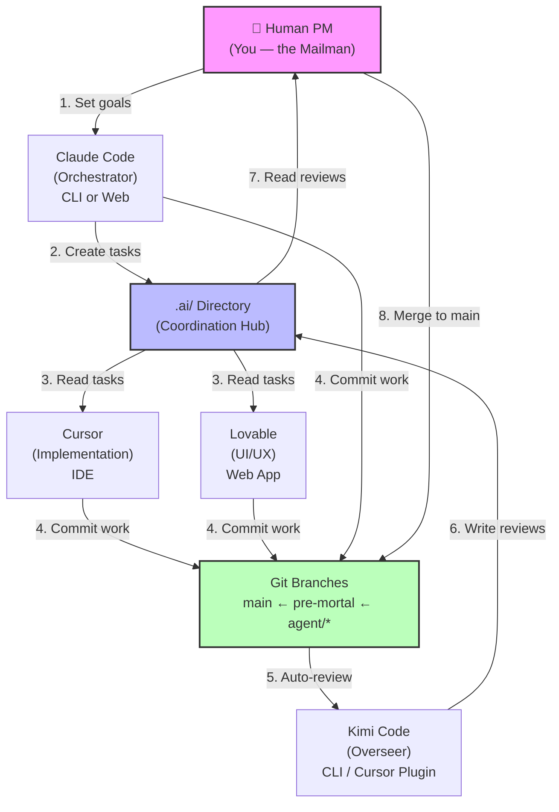

# Development Flow & Human-in-the-Loop

How the team works together. You (the Human PM) are the single coordination point — the "mailman" — who sets goals, reviews work, and makes final decisions.

## The Team

Five roles, each running in a specific environment.

| Role | What They Do | Where They Run | What They Read/Write |
|------|-------------|----------------|---------------------|
| **Human PM** (you) | Set goals, review work, approve merges, make decisions | Browser + terminal | `.ai/status.md`, `.ai/reviews/`, git branches |
| **Claude Code** | Orchestrator — architecture, task decomposition, code review, docs | Claude Code CLI (local terminal) or claude.ai (web) | `AGENTS.md`, `CLAUDE.md`, `.ai/` (owns all coordination files) |
| **Cursor** | Implementation — features, bug fixes, services, logic | Cursor IDE | `.cursor/rules/`, `.ai/tasks/`, `.ai/instructions/` |
| **Lovable** | UI/UX — components, layouts, styling, design | Lovable web app | `.ai/lovable-knowledge.md`, task briefs |
| **Kimi Code** | Overseer — automated review, sprint management, quality checks | Kimi Code CLI (inside Cursor as plugin, or terminal) | `.agents/`, `.ai/reviews/`, commit history |

### Claude Code: Web vs. Local

Claude Code can run in two places. Same agent, same config — just different access:

| Context | Best For | Limitations |
|---------|----------|-------------|
| **Local (CLI)** | File editing, git operations, running scripts, full repo access | Terminal only |
| **Web (claude.ai)** | Planning, research, conversation, artifact generation | No direct file access — copies text back and forth |

Use local for hands-on work. Use web for thinking and planning. Both read the same `CLAUDE.md` and `AGENTS.md`.

## Your Role: The Mailman

You are the **single human in the loop**. You don't write code — you coordinate:

### What You Do

1. **Set goals** — Write sprint goals or tell Claude Code what to build next
2. **Review work** — Check `.ai/reviews/` for Kimi's review decisions; review `pre-mortal` branch before merging to `main`
3. **Unblock** — When agents disagree, are stuck, or need a decision, you decide
4. **Relay messages** — Pass handoffs between agents that can't talk directly (e.g., Cursor → Claude Code)
5. **Approve production** — Final merge from `pre-mortal` → `main` is always yours

### What You Don't Do

- Write code (agents do that)
- Create task briefs (Claude Code does that)
- Review every commit (Kimi does automated review)
- Manage branch strategy (it's defined in AGENTS.md)

## Where to Look (Single Pane of Glass)

Your primary dashboard is the `.ai/` directory:

| What You Want to Know | Where to Look |
|----------------------|---------------|
| What's happening right now? | `.ai/status.md` |
| What tasks are in flight? | `.ai/tasks/` |
| Has work been reviewed? | `.ai/reviews/` |
| What did agents report? | `.ai/reports/` |
| Are agents talking to each other? | `.ai/chats/` |
| What instructions were given? | `.ai/instructions/` |
| What are the feature ideas? | `.ai/ideas.md` |
| Are there git branches to review? | `git branch -a` |
| Is pre-mortal ready for main? | `git diff main..pre-mortal` |

**Tip**: Start every session by reading `.ai/status.md`. It's the sprint board.

## When to Step In

You don't need to be involved in every action. Here's when you should step in:

| Trigger | What to Do |
|---------|-----------|
| **Sprint start** | Set goals. Tell Claude Code what to focus on. |
| **New review in `.ai/reviews/`** | Read it. If Kimi approved, move on. If rejected, decide: fix it or override. |
| **Agent is blocked** | They'll mention it in `.ai/status.md` or a chat. Unblock by making a decision. |
| **Agent disagrees with another agent** | Read both sides (in `.ai/chats/` or reviews). Make the call. |
| **`pre-mortal` branch has new work** | Review the diff. Merge to `main` if satisfied. |
| **Sprint end** | Read `.ai/reports/` for the sprint summary. Set goals for next sprint. |
| **You get a handoff message** | Read it, decide, relay the response to the other agent. |

**When NOT to step in**: Agents working on tasks, automated reviews, routine commits, Kimi assigning work.

## The Handoff Sequence

How work flows from your goals to production:

```
You set goals
    ↓
Claude Code decomposes into tasks (.ai/tasks/)
    ↓
Tasks get assigned (by you, Claude Code, or Kimi)
    ↓
Agent works on a branch (cursor/TASK-XXX, claude/TASK-XXX)
    ↓
Agent commits with [AGENT:x] [ACTION:submit] [TASK:z]
    ↓
Kimi reviews automatically (if Git hooks enabled)
    ↓
Review goes to .ai/reviews/ — approve or reject
    ↓
If rejected → agent fixes → resubmit
If approved → merge to pre-mortal
    ↓
You review pre-mortal
    ↓
You merge pre-mortal → main (production)
```

## How Work Flows (Diagram)



## Common Scenarios

### "I want to start a new feature"

1. Tell Claude Code (local CLI or web): "I want to add [feature]. Please create a task brief."
2. Claude Code creates `.ai/tasks/TASK-XXX.md` with acceptance criteria
3. You (or Claude Code) assign it: "Cursor, pick up TASK-XXX"
4. Cursor works on branch `cursor/TASK-XXX`
5. Cursor submits → Kimi reviews → you review `pre-mortal` → merge to `main`

### "An agent is asking me a question"

1. Read the message (in `.ai/chats/`, a handoff doc, or relayed to you)
2. Make your decision
3. Relay it back: paste the answer into the agent's chat/terminal
4. If it affects the sprint, update `.ai/status.md`

### "I want to see what happened while I was away"

1. Read `.ai/status.md` — current sprint state
2. Check `.ai/reviews/` — any pending reviews?
3. Check `.ai/reports/` — any new reports?
4. Run `git log --oneline -20` — recent commits
5. Check `git branch -a` — any branches to review?

### "Kimi rejected something but I think it's fine"

1. Read the review in `.ai/reviews/`
2. If you disagree with Kimi's rejection, you can override
3. Tell the agent: "I've reviewed this, it's approved. Proceed."
4. Log the override in `.ai/boundaries.md` under Governance Notes

### "I need to relay a message between agents"

1. Copy the message from one agent's output
2. Paste it into the other agent's input
3. Optionally save it in `.ai/chats/` for the record
4. That's the "mailman" job — you're the bridge between terminals
